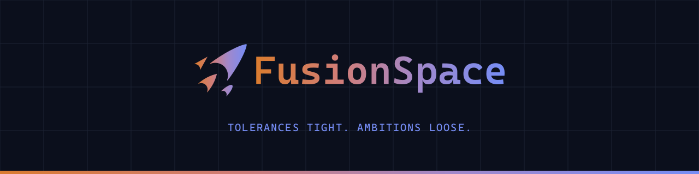

<picture>
  <source media="(prefers-color-scheme: dark)" srcset="kit/github/readme-banner-dark.png">
  <source media="(prefers-color-scheme: light)" srcset="kit/github/readme-banner-light.png">
  
</picture>

# FusionSpace: brand system, Rev C

Everything I make, under one name. The identity for my own projects (software and embedded systems, games, electronics, mechanical and machined parts, aerospace), rebuilt in 2026 using only free tools (Inkscape, FreeCAD, GIMP) and open-source fonts. It keeps the original 2023 idea, a loose cluster of four shapes with the soft orange-to-blue gradient and Cascadia Mono, but Rev C turns the four stars into four nose cones and redraws everything with exact geometry.

Open `guide/index.html` in a browser for the full guide.

## The idea

- **Name.** Stars run on nuclear fusion, so the brand is *FusionSpace*.
- **Mark.** Four nose cones in a diamond, each a real rocketry profile: Von Kármán (main, north), conical (west), elliptical (east) and a tangent ogive tail (south). Profiles follow the standard nose-cone equations, each 3.50× as long as its base radius, with a notch 1.00 of the base radius deep and feet cut flat where the wall is 0.05 of the base radius wide. With *r* as the Von Kármán base radius, the others are 0.4 *r* (conical), 0.3 *r* (elliptical) and 0.5 *r* (ogive). Spacing is measured on a grid leaned 45°: the ogive sits on the Von Kármán axis with its tip 0.2 *r* below the Von Kármán foot line, and the wings' centroids share a line 0.47 *r* below it, with the conical 0.19 *r* and the elliptical 0.23 *r* out from the Von Kármán feet (exact values are in `color/fusion-space-tokens.json`).
- **Colour.** One gradient sweeps left to right across the whole mark, from M-class orange `#DA7C30` through rose and lavender to O-class blue `#768DF5`. The end colours start from the M- and O-class star colours of the Harvard stellar classification, deepened so the whole gradient holds at least 3:1 on white and 6:1 on Void. It is the same gradient on dark and light backgrounds.
- **Wordmark.** `FusionSpace`, one word, in Cascadia Mono SemiBold with the same gradient.
- **Projects.** Each project is named after an IAU-approved star, which becomes its code: `FS-VEGA`, then drawings `FS-VEGA-001`, with revisions A, B, C…

## Folder map

| Folder | Contents | Opens in |
|---|---|---|
| `logo/mark` | The four-cone mark: `fusion-space-mark` (gradient), `-void` and `-white` (one colour), `-twotone-on-dark` and `-twotone-on-light` (flat two-tone), plus `fusion-space-mark-50mm.dxf` (lines and arcs only) for laser/CNC | Inkscape, FreeCAD, CAM |
| `logo/lockup` | Horizontal and stacked lockups, each as `color`, `twotone-on-dark`, `twotone-on-light`, `void` and `white` | Inkscape |
| `logo/wordmark` | Wordmark alone | Inkscape |
| `logo/png` | Transparent PNG exports of all the above | anything |
| `logo/favicon` | `favicon.svg` (full cluster, framed for 16–48 px), `icon.svg` (full cluster), `app-icon.svg` (square tile for iOS/Android), `.ico`, PNGs, `apple-touch-icon.png` | web |
| `color` | `fusion-space.gpl` palette (includes the gradient stops), CSS and JSON tokens | Inkscape, GIMP, code |
| `type/fonts` | Cascadia Mono and Archivo (SIL OFL) | install once |
| `graphics` | Mark construction drawing, gradient strip, spectral bar | Inkscape |
| `templates` | GitHub social card (1280×640), plus FreeCAD TechDraw sheets in ANSI A, ANSI B and A4 | Inkscape, FreeCAD |
| `tools/star-name-picker` | `index.html` picker and the cleaned `iau-star-names.csv` | browser |
| `tools/mark-tuner` | `index.html`: tune the mark and both lockups in the browser and export SVGs | browser |
| `tools/build` | The scripts that build every file here (`python3 tools/build/build.py`); see `tools/build/README.md` | terminal |
| `guide` | Brand guide | browser |
| `kit` | Asset kit, ready for any project: every logo in every colour mode and size; web/app icons; GitHub and social images (dark and light); letterhead, covers, business cards, email signature, slides; boot logos for OLED/TFT displays; KiCad PCB logos; 3D-print files (STL, STEP, two-colour 3MF, sketches, a parametric badge); terminal themes and CLI banners; game splash and store art; logo animation; wallpapers; merch and posters; cut files, stickers, engraving and embroidery. Open `kit/index.html` to browse, `kit/README.md` for the list | everything |
| `tools/build/project.py` | Per-project images: `python3 tools/build/project.py --name Vega --tag EMB --desc "..."` makes a project's social preview, README banners, OG image, YouTube thumbnail, title slides, report covers and starter README | terminal |

## Palette

| Role | Name | Hex |
|---|---|---|
| Gradient | M orange 0% · Rose 35% · Lavender 65% · O blue 100% | `#DA7C30` `#D07D7A` `#A188CB` `#768DF5` |
| Core | Void · Abyss · Graphite · Slate · Haze · Mist · Paper · White | `#0B0F1C` `#141A2B` `#2A3248` `#566079` `#98A1B8` `#D6DAE4` `#F3F4F7` `#FFFFFF` |
| Signal | Ion (links/UI on light) · Ember (highlights on light) | `#3350D6` `#B34F0C` |
| Spectral | O · B · A · F · G · K · M | `#768DF5` `#AABFFF` `#CAD7FF` `#F8F7FF` `#FFF4EA` `#FFD2A1` `#DA7C30` |

## Type

- **Wordmark / display.** Cascadia Mono SemiBold, the same face as the original logo.
- **Text.** Archivo Regular.
- **Technical.** Cascadia Mono Regular, for part numbers, dimensions and title blocks.

## Setup

1. Install every font in `type/fonts`.
2. Copy `color/fusion-space.gpl` to `~/Library/Application Support/org.inkscape.Inkscape/config/inkscape/palettes/`, then restart Inkscape.
3. For FreeCAD, open TechDraw → *Insert Page using Template* and pick a file from `templates/freecad`. The title-block fields are editable, and on FreeCAD 1.0+ some fill themselves in (author, date, scale, sheet). The sheets are transparent; with a dark TechDraw page colour use the `-dark` ones, and print from the light ones.
4. The wordmark is outlined in every logo file. Each file also has a hidden, locked "live text" layer for when you want to retype it.

## Rules

- Keep 0.25 H clear space around the logo, where H is the cluster height. The minimum cluster height is 24 px (8 mm). Below 24 px, as in favicons, use the favicon files: they are the full cluster, hinted for 16 px (the two wing cones become small arrows).
- In the horizontal lockup the mark is 1.92× the cap height of the wordmark, before it, with a gap of 0.35 × the cap height (0.183 × the mark height). In the stacked lockup the mark sits above the wordmark with a gap of 0.10 H (to the cap line). These are the only approved arrangements; don't put the mark after or below the wordmark.
- The gradient always runs left to right, M orange to O blue. It is the same on dark and light backgrounds. Don't reverse it, recolour it, or add outlines, shadows or glows.
- Where gradients can't be reproduced (spot-colour print, vinyl, embroidery), use the flat two-tone versions. The cones are the same on every background, M orange `#DA7C30` (warm) and O blue `#768DF5` (cool); only the wordmark changes, white on dark and Void on light (`twotone-on-dark`, `twotone-on-light`). Each cone takes the nearer end of the gradient.
- On light backgrounds, a horizontal lockup under 32 px tall uses the one-colour Void lockup (`fusion-space-horizontal-void`): at that size the thin gradient details are too faint on light.
- Ion `#3350D6` and Ember `#B34F0C` are text and UI colours on light (links, warnings), not logo colours.
- Don't stretch the cluster, change the 45° lean, or move, add or drop cones.
- The gradient logo works on Void, white and Paper. For single-colour production (engraving, laser, vinyl, stamps), use the `void` or `white` files, or the DXF.
- **Minimum feature size.** In the master artwork the feet are cut where the wall is 0.05 of each cone's base radius wide, which is only 0.18 mm on the elliptical cone at 50 mm. The DXF trims the feet so every foot is at least 0.5 mm wide, then scales the trimmed outline to exactly 50 mm tall; nothing else changes. Laser vendors typically need features of about half the material thickness, so for stock thicker than about 1 mm, scale the DXF up or ask the vendor. The cone tips are true points: ask the vendor to apply their usual tip radius.

## Licence and trademarks

- **Code.** The build scripts and the mark tuner in `tools/` are licensed under the Apache License 2.0 (`tools/LICENSE`). The
  licence covers the code, not the FusionSpace name or logo, including the artwork the code draws.
- **Brand.** The FusionSpace name, the four-cone mark, both lockups and every brand file here (`logo/`, `kit/`, `guide/`,
  `graphics/`, `color/`, `templates/`, `source/`) are © 2026 Neer Patel, all rights reserved. They're published to show the work.
  `TRADEMARKS.md` says what's fine, such as linking to my projects and showing the logo unchanged when you mention them.
- **Fonts.** Archivo and Cascadia Mono in `type/fonts/` are under the SIL Open Font License, with the licence files next to them.

See `LICENSE` for the full terms.
