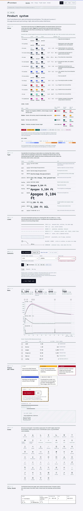

# FusionSpace product system

How FusionSpace things are designed: websites, in-browser tools and PWAs, command-line tools, iOS and Android apps, macOS,
Windows and Linux apps, flight computers and other devices, PCBs and enclosures, and rockets. The rest of this repository says what the brand looks like;
this folder says how a product made under it looks, reads and behaves.

Every FusionSpace project points here for its design rules. Rev A, October 4, 2026.



## Read in this order

| | Document | What it decides |
|---|---|---|
| 1 | [Principles](principles.md) | The eight rules everything else follows |
| 2 | [Foundations](foundations.md) | Color roles and signals, themes, type, space, lines and shape, motion, icons, tokens |
| 3 | [Data](data.md) | Numbers, units, readouts, tables, charts, maps, live telemetry, exports |
| 4 | [Writing](writing.md) | Voice, "how far to trust it", screen copy, errors, signal words, names |
| 5 | [Web](web.md) | Sites, tools, PWAs, docs; using `fusionspace.css`; fusionspace.co |
| 6 | [Command line](cli.md) | Output, color, help, errors, exit codes; Rust and Python styles |
| 7 | [iOS and Android](mobile.md) | What the platform owns, what FusionSpace owns, field use, devices, widgets |
| 8 | [macOS, Windows and Linux](desktop.md) | Desktop apps: native behavior per platform, dense engineering views, devices, updates |
| 9 | [Flight computers and devices](embedded.md) | Arming, three-state channels, beeps, lights, screens, ground stations |
| 10 | [Boards, enclosures and labels](hardware.md) | Designations, silkscreen, board shape, enclosures, cables, drawings |
| 11 | [Rockets](rockets.md) | Livery, roll pattern, markings, flight card, pad checklist |
| 12 | [Review](review.md) | The FusionSpace test, template smells, release checklists, sources |

## The idea in one paragraph

FusionSpace products are drawn, not decorated: every screen is a sheet from a drawing set, with a 2 px edge, a sheet number, a
title block, and lines that mean what they mean on a drawing (solid measured, dashed predicted, chain for references, hatch
for the unavailable). They show their working and say how far to trust it. They're built for a launch field: offline,
readable in sun, operable with gloves. Color that means something is rare and follows the cockpit and spacecraft standards,
and the brand's gradient appears once per view, as identity only. Every product has a designation and a revision, like a
part. On phones and in terminals, the platform owns behavior and FusionSpace owns content.

## Files

| Folder | Contents |
|---|---|
| [`tokens/`](tokens/) | Every color role, type style, space, line, motion and target value: DTCG JSON, CSS, Swift, Kotlin, C |
| [`web/`](web/) | `fusionspace.css`, `tailwind-theme.css`, WOFF2 fonts, the specimen page, four example screens, an mdBook theme, previews |
| [`icons/`](icons/) | 60 icons for rocketry and interfaces, one SVG each and a sprite |
| [`cli/`](cli/) | Terminal styles for Rust (clap, anstyle) and Python, with sample output |
| [`embedded/`](embedded/) | Device-screen mock-ups (OLED, TFT) and LVGL styles |
| [`hardware/`](hardware/) | KiCad board title-block footprints |
| [`rockets/`](rockets/) | Livery wrap sheets for five airframe diameters, 1.64 to 6.17 in |
| [`desktop/`](desktop/) | Windows ICO and MSIX tiles, Linux icons, `.desktop`, AppStream and udev templates |

Everything here is generated by `tools/build/kit_product.py` from the sources in `source/product/`; change those, not these
files. The build measures every color pair the rules rely on, and stops if one falls short.

## Pointing a project here

Put this in the project's README (or its contributor notes) so anyone working on it, person or tool, follows the same rules:

```markdown
## Design

This project follows the FusionSpace product system:
https://github.com/nrdptel/fusionspace-design/tree/main/product

- Principles and foundations apply to everything; also read <web.md | cli.md | mobile.md | desktop.md | embedded.md | hardware.md | rockets.md>.
- Colors, type and spacing come from product/tokens/ (copied into <path>); no other colors.
- Designation: FS · SW · TOOL 00n. Show it, with the version, in the title block / about screen.
- Run the checklist in product/review.md before each release.
```

Copy the token or stylesheet files into the project rather than linking to them, so a change here is a deliberate update
there (note the system's revision when you copy).

## Status

Rev A, October 4, 2026, approved in review on October 5, 2026: the four signal colors (Flare, Sodium, Aurora, Nebula) and Steel
with their names, the beep language in [`embedded.md`](embedded.md#beeps), the rocket scheme in [`rockets.md`](rockets.md#color),
US spelling, dates and number style everywhere, the terminal theme retuned to the signal colors, and the license below
(Apache-2.0 for the code-like files). The beep language stays a draft until it is tested by ear on the first flight computer. Change any of these through `tools/build/kit_product.py` and
`source/product/`, and raise the revision.

## License

- **Apache-2.0** (copy them into any project, open source or not): `tokens/`, `web/fusionspace.css`, `web/tailwind-theme.css`,
  `web/mdbook/`, `cli/`, `embedded/fs_lvgl_styles.c` and `.h`, and the templates in `desktop/linux/`. Each has an SPDX line.
- **All rights reserved**, published to show the work: the rules, icons, examples, previews, mock-ups, footprints and livery
  sheets, as for the rest of the brand (`LICENSE`, `TRADEMARKS.md`).
- **SIL OFL:** the fonts in `web/fonts/`.
- The Apache license covers code, not the FusionSpace name or logo.
