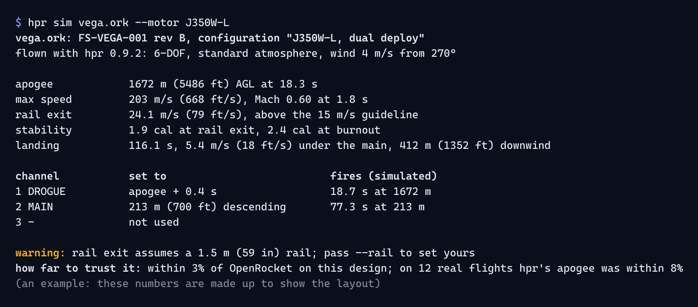

# Command line

FusionSpace command-line tools (`hpr`, build scripts, firmware utilities) follow the Command Line Interface Guidelines
(clig.dev) and look like a well-kept lab notebook: labeled columns, units on every value, and color only where it carries
meaning. hpr-sim's `hpr` is the model; drop-in styles for Rust and Python are in [`cli/`](cli/).



## Output

- **Results to stdout, everything else to stderr**: progress, warnings, errors, the banner. Piping `hpr sim … > out.txt`
  captures only the result.
- **A label column, then values.** Labels are lower case, padded to one width; each value has its unit; an alternative unit
  goes in brackets after it; context follows a comma or a colon. This is how `hpr analyze` already reads:

  ```
  apogee            390.1 m (1280 ft) at 10.28 s, 9.72 s after liftoff
  top speed         79.9 m/s (262 ft/s) at 2.10 s, 64.0 m (210 ft) up: the logger's own, from its barometer
  top acceleration  withheld: a PerfectFlite logger has no accelerometer
  ```

- **The first line says what was read**: file, device, serial, flight. The last lines say what to trust: what was withheld
  and why, in words.
- **Numbers** follow [`data.md`](data.md#numbers), except digit grouping: no separators in terminal output, so values copy and
  parse cleanly (`1280 ft`, not `1,280 ft`). A real minus sign is fine in prose output; machine output uses ASCII `-`.
- **Tables** have a header row in bold, columns aligned (numbers right), no box-drawing borders unless the table has more than
  about six columns.
- **Machine output.** `--json` prints one document with units in its keys or schema, published and versioned. `--plain` (or
  CSV) for traces. Neither ever contains color, a banner, progress or prose.
- **Fast feedback.** Print something within 100 ms. Anything over a second gets progress on stderr (a bar with a count and an
  estimate), hidden automatically when stderr isn't a terminal.

## Color

Terminals remap the 16 ANSI colors to the user's own theme, and that is how it should be: brand RGB in a terminal ignores the
user's theme and contrast. FusionSpace CLIs use **ANSI roles only**, matched to the product's color roles:

| Role | ANSI | Product role | Used for |
|---|---|---|---|
| Heading | bold | ink | Section titles, table headers, the result's first line |
| Literal | bold blue | action | Commands, flags and values to type, in help and hints |
| Placeholder | blue | action | `<FILE>`, `<MOTOR>` in help |
| OK | green | ok (Aurora) | `CONT`, `passed`, `fired` |
| Caution | yellow | caution (Sodium) | `warning:`, values near a limit |
| Danger | bold red | danger (Flare) | `error:`, `NO CONT`, failed checks |
| Predicted | magenta | predicted (Nebula) | Simulated or forecast values when shown beside measured ones |
| Muted | dim | rule | Separators and decoration only, never text someone must read |

- With the FusionSpace terminal theme (`kit/software/terminal/`), the colors are the product's own: red is Flare, green
  Aurora, yellow Sodium, magenta Nebula (their inks on dark) and blue O blue. In any other theme they follow that theme.
- **Status is never color alone.** Every colored word is also a word: `error:`, `warning:`, `CONT`, `NO CONT`, `passed`.
- Brand truecolor (the gradient, M orange, O blue) only for the banner, only when `COLORTERM` is `truecolor` or `24bit`.
- **When to color:** `--color auto|always|never`; auto colors only when the stream is a terminal, `TERM` isn't `dumb`, and
  `NO_COLOR` isn't set. Precedence: the flag, then `NO_COLOR`, then `FORCE_COLOR` / `CLICOLOR_FORCE`, then auto. stdout and
  stderr are decided separately.

## Help

- `--help` starts with one line saying what the tool does, then `Usage:`, then commands, then options, then two or three
  examples of real use, then where the docs are. `-h` is the short version.
- Commands are verbs or noun-verb pairs: `hpr sim`, `hpr motors search`, `hpr weather open-meteo`. Flags are long and
  readable (`--motor`, `--units`), with short forms only for the common few.
- Commands that exist but aren't ready say so and name what brings them, as `hpr` does, rather than pretending not to exist.

## Errors

Follow rustc and cargo: the kind, what happened, where, and what to do.

```
error: no motor named J350 in the catalog
  --> --motor J350
help: the catalog has J350W-L and J350W-M; `hpr motors list --class J` lists every J motor
```

- `error:` in bold red, `warning:` in bold yellow, `help:` in bold blue, `note:` in bold. The most useful line last.
- Name the thing the way the user typed it. Suggest the closest valid value.
- Never print a stack trace by default; `--verbose` or an environment variable shows it.

## Exit codes

| Code | Meaning |
|---|---|
| 0 | Did what was asked. |
| 1 | An input was missing, unreadable or refused; or a check (validate, test) failed. |
| 2 | The command line was wrong (clap's default for usage errors). |
| 3 | The command exists but isn't available yet. |

With `--json`, an error is a JSON document on stdout with a `kind` matching the code, so scripts never parse prose.

## Interaction and config

- Prompt only when stdin is a terminal; `--no-input` (and a non-terminal stdin) turns every prompt into an error that says
  which flag to pass.
- Destructive or energetic actions (writing firmware, arming over a link) ask for the name of the thing, not just `y`:
  `Type the board serial to continue`.
- Config precedence: flags, then `TOOL_*` environment variables, then `./tool.toml`, then
  `~/.config/<tool>/config.toml`. `tool config show` prints the result and where each value came from.

## The banner

The braille lockup in `kit/software/banner/` is for `--version` and for the bare command run in a terminal, nothing else.
Never in piped output, `--json`, `--quiet`, CI (`CI` set) or after the first line of a result. Monochrome under `NO_COLOR`;
gradient only with truecolor; never animated.

## Drop-in styles

| File | For |
|---|---|
| [`cli/fs_style.rs`](cli/fs_style.rs) | Rust: a `clap::builder::Styles` with the roles above, `anstyle` constants, and `color_choice()` with the precedence rules (anstream doesn't read `FORCE_COLOR` itself) |
| [`cli/fs_style.py`](cli/fs_style.py) | Python: the same roles as ANSI codes, with the same detection, no dependencies |
| [`cli/sample-output.txt`](cli/sample-output.txt) | The example in the picture, as plain text |
