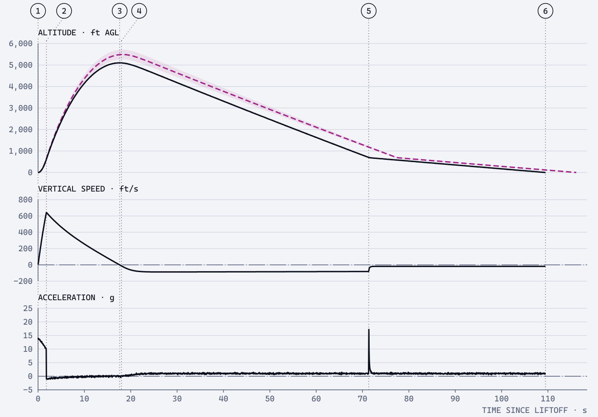

# Data

Numbers, units, readouts, tables, charts, maps and live telemetry. Most FusionSpace products exist to show a number someone
will act on, so this is where the principles matter most: show the working, and say how far to trust it.

## Numbers

| Rule | Write | Not |
|---|---|---|
| A space between a number and its unit (SI) | `21.5 °C`, `644 ft/s`, `7.0 %` | `21.5°C`, `644ft/s` |
| Except plane angles | `45°`, `270°` | `45 °` |
| Group digits in threes with a narrow no-break space (U+202F), from four digits | `5 104 ft`, `0.000 52` | `5,104 ft`, `5.104 ft` |
| No grouping in drawing callouts and part numbers | `FS-VEGA-001`, `Ø 98.0` | |
| A real minus sign (U+2212) | `−200 ft/s` | `-200 ft/s` |
| A leading zero below 1 | `0.58` | `.58` |
| A plus sign only on differences | `+382 ft`, `−7.0 %` | `+5 104 ft` |
| Precision that matches what is known | `5 104 ft` (barometer) | `5 103.87 ft` |
| A spread with its meaning | `5 486 ± 227 ft (1σ)` | `5 486 ft ±227` |
| Ranges with an en dash and one unit | `5 100–5 500 ft` | `5100 ft - 5500 ft` |
| Fields are sized for the longest value; if one still overflows, asterisks in caution ink, with the full value in its accessible name | `*****` | a cut-off number |

- Numbers are Cascadia Mono, or Archivo with tabular figures; right-aligned in columns, aligned on the decimal point.
- Keep the unit beside every value or in the column head (`APOGEE · ft AGL`). A number without a unit is a bug.
- Unit symbols are never pluralised or followed by a full stop: `3 lb`, `12 in`.
- In code, keep values in SI and convert only for display. Never store a rounded display value.

## Copying and typing numbers

The typography above is for reading. Anything that leaves the screen as text, or comes in from a keyboard, is plain:

- **Copy, export, URLs, JSON, CSV:** ASCII only. A hyphen-minus, a full stop as the decimal point, no digit grouping, no
  narrow spaces: `-119.06274`, `1556`. A real minus sign or a U+202F space breaks GPS apps, spreadsheets and code.
- **Typing:** trim spaces; accept the decimal separator of the user's locale; refuse a value whose comma could be either a
  decimal or a thousands separator (`1,280`) and ask; then show the value as read, with its unit (`Read as 3.90 in`).

## Units for rocketry

US high-power flyers mostly think in feet, pounds and miles per hour, while motors are rated in newtons and newton-seconds and
most logs are metric underneath. Tools default to what the user expects and switch with one control (a `ft | m` segmented
control, or `--units` in a CLI), and the choice applies everywhere at once.

| Quantity | US default | SI | Note |
|---|---|---|---|
| Altitude | ft AGL | m AGL | Always say AGL or MSL. Default AGL; pad elevation shown in the source. |
| Vertical and air speed | ft/s | m/s | Add Mach for anything over about 0.3. |
| Wind | mph | m/s | The 20 mph surface-wind limit (NAR, Tripoli) is in mph. |
| Mass | oz, lb | g, kg | Black powder is always in grams, to 0.05 g. |
| Length, diameter | in | mm | Airframes are named by their own diameter (3 in, 4 in, 98 mm); motor mounts by the motor's (29, 38, 54, 75, 98 mm). |
| Thrust | N | N | Motors are rated in newtons; lbf only as a secondary. |
| Total impulse | N·s | N·s | With the class letter: `J · 684 N·s`. |
| Pressure | psi | kPa, hPa | psi for ejection charges; hPa for weather. |
| Temperature | °F | °C | |
| Acceleration | g | m/s² | g for flight logs. |
| Stability | cal | cal | Calibres, with the CG and CP positions it came from. |

- **Motor designations** are shown exactly as printed (`J350W-L`), next to what they mean: class J (640–1 280 N·s), 350 N
  nominal average thrust, propellant W, delay L. Where the measured average differs (ThrustCurve.org), show both.

## Readouts

A readout is a single value a screen exists to show: apogee, charge mass, wind speed.

```
APOGEE · PREDICTED            label: what, and which kind (measured, predicted, forecast, copied)
5 486 ft AGL                  value in Cascadia Mono, unit beside it, muted
± 227 ft (1σ) · hpr-sim 0.9   qualifier: spread, source, time
```

- **The label says the kind.** Measured, predicted, forecast, or from another source. A predicted readout is underlined with a
  dashed Nebula rule and its qualifier gives the spread.
- **Stale or missing data** turns muted with a hatched block beside it, and the qualifier gives its age: `issued 10:00, 4 h
  old`. Unavailable is `—` with a reason and a text alternative ("not available"), never `0`.
- **Limits.** When a value crosses a limit, add a caution or danger chip with the word (`GUSTS 19 mph · LIMIT 20`), and an
  arrow showing the direction it's moving. Don't recolour the number itself.
- One readout per screen is large (`readout-l`, 40 px); the rest are `readout` (28 px) or table cells.

## Tables

- Real table markup. Wrap wide tables in a scrolling region rather than turning rows into cards.
- Column heads are labels (12 px Cascadia Mono, capitals) with the unit: `TIME · s`. A 2 px ink rule under the head, 1 px rules
  between rows, no zebra stripes, no vertical rules.
- Numbers right-aligned; text left-aligned; dates as `2026-10-04`.
- Status cells use chips (word + shape + colour). An unused row says "Not used" in grey.
- A caption above the table says what it is and where the data came from.

## Charts

FusionSpace charts are drawings: ink on a canvas, with the line types from [foundations](foundations.md#lines-and-shape).



- **Stack, don't overlay.** Altitude, speed and acceleration are separate panels on one shared time axis, with one cursor that
  moves through all of them. Never two y-axes on one panel.
- **Measured is solid ink, predicted is dashed Nebula** with its spread as a band around it (the band's fill at 10 % opacity). When both are shown, add a
  residual panel (measured − predicted) on the diverging scale when the difference is the point.
- **Events** (liftoff, burnout, apogee, deployments, landing) are dotted vertical lines with numbered balloons at the top, and a
  table below gives each number its name, time, value and source. Balloons that would collide step right along a short leader.
- **References** use the chain line: ground level, the rail length, the waiver ceiling, a limit. Limits that matter for safety
  are a 2 px danger line, labelled.
- **Uncertainty** is a band or hatched area, never a lone number. Monte Carlo landing dispersion shows the individual landing
  points as small dots with 1σ, 2σ and 3σ ellipses outlined (not filled).
- **Aspect ratio.** Choose the panel's width and height so the important slopes run near 45° (Cleveland's banking to 45°), the
  angle at which the eye compares slopes best.
- **Labels** are 12 px Cascadia Mono. Axis titles carry units (`ALTITUDE · ft AGL`). Ticks at round numbers; 3 to 6 per
  axis. Gridlines are 1 px rule colour.
- **No legend boxes.** Label lines directly, or explain the line types once in the caption.
- **Accessible.** Every chart has a caption, a text summary of what it shows ("Apogee 5 104 ft at 17.6 s, 7.0 % under the
  prediction"), and the data as a table or a CSV link. On iOS, Swift Charts' audio graphs; on Android, semantics on the
  summary.
- **Libraries.** uPlot for long or live time series (fast, small); Observable Plot or hand-drawn SVG for reports; Swift Charts
  and Vico (or Canvas) natively. Whatever draws it, the rules above apply.

## Maps

Recovery maps, launch sites and landing dispersion.

- North up, always, with a scale bar in the current units and the map's date.
- Coordinates as decimal degrees to five places (about 1 m): `40.86512, −119.06274` on screen, with a copy button that copies
  plain ASCII (`40.86512,-119.06274`). Offer degrees and minutes for radios and handheld GPS.
- Bearings say true or magnetic (`062° T`); magnetic declination is more than 10° in much of the western US.
- The pad is a filled square; the rocket's last known position is a diamond with its age; predicted landing is a Nebula
  dashed ellipse. Show the GPS fix (satellites, HDOP) next to any position.
- Base maps are muted (greys) so the overlays carry the colour. Tiles are cached before the trip; the map works offline.

## Live telemetry

Ground stations, apps connected to a flight computer, countdown screens.

- **Update rates.** Precise values update at most once a second; trends 3–4 times a second, drawn as a trace.
- **Time.** Countdown `T−00:00:10`, counting through zero to `T+00:00:18.0`. Clock times in 24-hour with the zone: `14:10 MDT`.
  Every time says what it is measured from.
- **Stale.** Each value knows its age. Past a threshold (2 s for flight data, 30 min for weather) it turns muted with a hatched
  block, and the age shows. A link that drops says so in words.
- **Commanded vs confirmed.** Anything that changes the hardware (arm, safe, fire, reset) shows the command sent and the state
  the hardware reports, separately: `Commanded: ARM · Confirmed: SAFE (waiting 1.2 s)`.

## Files and exports

- CSV: one header row with units in brackets, `time [s],altitude [ft AGL],vertical speed [ft/s]`; SI by default with an
  option for US units; ISO 8601 timestamps. It must open cleanly in a spreadsheet, so the source, tool, version and date go in
  a sidecar file (`flight-03.meta.json`), or in `#` comment lines only where the reader is known to expect them.
- JSON: units in the key or in a schema (`"apogee_m"`, or `{"value": 1556, "unit": "m"}`), never implied.
- Every export carries the designation and version of the tool that made it, like a title block.
