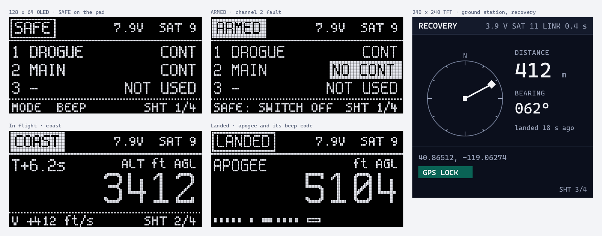

# Flight computers and devices

Screens, lights, beepers, switches and buttons on FusionSpace hardware: flight computers, trackers, ground stations, pad
boxes. These are the products where a misread can cost a rocket or hurt someone, so the rules lean hardest on the standards
(NASA-STD-3001, MIL-STD-1472H, the NAR and Tripoli safety codes) and on what flyers say goes wrong with today's altimeters.

Firmware color constants: [`tokens/fusionspace_ui.h`](tokens/fusionspace_ui.h). Mock-ups: [`embedded/`](embedded/). Boot
logos for every common display: `kit/embedded/`.

## Arming and safety

- **Arm with a physical switch** in the airframe (a screw switch, a key, a magnetic switch with its ON end marked, or a
  pull-pin with a Remove Before Flight streamer from `kit/production/remove-before-flight/`). Not a slide or toggle on the
  outside, where it can be knocked (PerfectFlite's manual says the same). The NAR code requires firing circuits to stay
  inhibited until the rocket is in the launching position.
- **Arming from an app** is a second, separate step on top of the physical switch, never instead of it: a confirmation held
  for 2 s, showing the device's designation. It works only over a short-range link (Bluetooth) and only while the physical
  switch is on. There is no arming over a long-range radio.
- **SAFE is right of or below ARM** wherever both appear (NASA-STD-3001), and is always one action.
- **Commanded and confirmed** states are shown separately. The device reports its real state; the app never assumes.
- **One cue per meaning.** ARMED (pyro outputs can fire) has its own cues and nothing else uses them: the inverted box on a
  screen, a dedicated ARM LED that is steady red, and the channel report repeating. A fault looks and sounds different
  (below). Fast red flashing (3 Hz) is kept for the one thing more urgent than ARMED: a charge that didn't fire.

## Energetics behavior

What the firmware must do, whatever the screen shows:

- **Off at power-up, reset and brownout.** Pyro outputs are held off in hardware (pull-downs on the gate drives) until the
  firmware has started and checked itself, and after any reset. A reset in flight never fires a channel unless saved state
  and the sensors agree the event is still due.
- **Continuity tests can't fire.** The test current is limited by hardware to well under the igniter's rated no-fire current
  (aim for a tenth of it or less), and the firmware never drives a channel to test it.
- **Lockouts.** No deployment before launch is detected (acceleration and pressure agree); no apogee from the barometer while
  the rocket is transonic (a Mach lockout from the accelerometer's velocity); no firmware update or configuration change
  while armed.
- **Ground tests** ("fire from the app") need the physical switch on, a separate ground-test mode that can't be entered
  after launch detect and times out after 2 minutes, a typed or held confirmation, and a 10 s countdown that SAFE cancels.
- **Backup.** Dual deploy flies with an independent backup: a second altimeter with its own battery and switch, and its own
  charges. Common practice, and expected on Level 3 certification flights; check the current NAR and Tripoli rules.
- **After landing,** any configured channel that didn't fire is reported first, on the screen, the LED and the beeper, before
  anything else (see below). Approach the rocket as live and disarm before handling.

## Channels: three states, and UNFIRED

Every pyro or deployment channel is always in one of these states, and each looks and sounds different:

| State | Screen | Channel LED | Beep (in the channel report) |
|---|---|---|---|
| **GO**: configured, continuity good | `1 DROGUE  CONT` | green, steady | one short tone |
| **FAULT**: configured, no continuity | `2 MAIN  !NO CONT` in an outline box (Sodium on color screens) | amber, 0.8 Hz | a rapid triple (three 60 ms tones) |
| **NOT USED**: not configured | `3 —  NOT USED` | off | one long tone |
| **UNFIRED** (after landing): configured, didn't fire | `UNFIRED 2 MAIN` inverted (Flare on color screens) | red, 3 Hz | the rapid triple three times, before the altitude |

An unused channel is never red (one popular altimeter app shows unused channels in red, "but that's o.k."; that trains people
to ignore red). A fault is caution, not danger: it means "don't fly like this", and must not look like ARMED. Channels are
always reported in the same order, 1 to n, and named with words, not just numbers: DROGUE, MAIN, APOGEE BACKUP, AIRSTART.

## Beeps

Every vendor's beep code is different (the digit zero alone is ten beeps on one, a long beep on another, a low beep on a
third). FusionSpace devices use one published language, coded by count and rhythm first and pitch second, and print it on a
card in the box and in the manual. It is a draft until it has been tested by ear at 10 m in wind, with the electronics in an
airframe, on the first FusionSpace flight computer:

- **Tones:** short 100 ms, long 400 ms; 150 ms between tones in a group, 600 ms between groups, 2 s before a sequence repeats.
  Two pitches, both near the piezo's resonance (for example 3.5 kHz high and 2.5 kHz low), as a second cue only.
- **Power on:** one long tone = self-test passed. A self-test failure is a continuous 2 s low tone, repeating, and nothing else
  until it is fixed (the screen or LED says which).
- **Channel report** (while armed, repeating): each channel in order, as in the table above, then the pause.
- **Numbers** (altitude after landing, battery voltage on request): each digit as that many short tones, **zero as one long
  tone**, 600 ms between digits, and two long tones to end the number. Altitude is in feet AGL unless set to meters, and the
  manual says which.
- **Loud enough for the field:** at least 95 dB at 10 cm, measured at each tone, from a piezo mounted to an opening, and checked
  by ear at 10 m on a windy day with the electronics in the airframe. (A common complaint is beepers that can't be heard.)

## Lights

| Pattern | Means |
|---|---|
| Green, steady and dim | Powered, nominal (full-brightness green dazzles at night) |
| Green, one blink every 2 s | Powered, idle, logging (saves power on the pad) |
| Red, steady (the ARM LED only) | Armed: pyro outputs can fire |
| Amber, 0.8 Hz | Needs attention: a channel fault, low battery, no GPS fix, link lost |
| Red, 3 Hz | Act now: a configured charge didn't fire |
| Off | Not used, or off |

- Two flash rates only, synchronized across all LEDs on the device. No blue or white status LEDs: they aren't signal colors.
- Every LED is labeled on the silkscreen with what it means (`PWR`, `ARM`, `GPS`, `CH1`, `CH2`), not just a reference
  designator.

## Screens

- **Dark roles on emissive screens** (OLED, TFT): light marks on Void read well in shade and at night, and Void pixels draw no
  power on an OLED. **E-paper and transflective LCDs** use the light roles, and are the right choice for anything read in
  full sun at the pad (OLEDs wash out in direct sun).
- **Layout on an 8 px grid.** Top row: state word, battery voltage as a number, GPS satellites, link age. Middle: the one
  readout the screen exists for, in a large numeral font. Bottom row: what the buttons do, and the page (`2/5`).
  On screens under 160 px wide the space between a number and its unit may be dropped (`7.9V`); everywhere else it stays.
- **States are boxes:** SAFE in an outline box, ARMED in an inverted (filled) box, so the difference shows in one bit of color
  and from across a table. Faults are outline boxes with `!`; only ARMED and UNFIRED are inverted.
- **Fonts:** a bitmap font at 1× (never a scaled-up one): Spleen (BSD-2, built into u8g2) at 5 × 8 and 6 × 12 for text, 8 × 16
  for headings, and one large numeral face for the readout. On TFTs with anti-aliasing, Cascadia Mono rendered with LVGL's
  font converter at 12, 16 and 28 px.
- **Burn-in.** A pad wait can last hours. Draw 1 px outlines rather than large filled areas, shift the whole screen by a pixel
  every few minutes, and dim after 60 s without input (never while ARMED).
- **E-paper:** fixed zones for partial refresh, a full refresh every 5 to 10 partial ones, never cut power mid-refresh, and
  always show when the screen was last updated. Below about 0 °C it slows down; say so.
- **Boot screen:** the mark from `kit/embedded/` for under a second, then the device's designation, board revision and firmware
  version, then the state. Never a boot animation that delays SAFE/ARMED information.
- **LVGL:** one custom theme built on the simple theme, with the colors from `fusionspace_ui.h`, square corners (radius 0),
  1 px borders, no shadows, and state styles (pressed, checked, disabled) shared across widgets.

## Buttons and switches

- Few physical buttons, each with one job, labeled on the enclosure with the result (`MODE`, `BEEP ALT`), not a symbol only.
- Long-press (2 s) for anything that changes configuration; nothing a button does can arm or fire.
- Switches that arm are guarded or recessed. No safety wire as a guard (MIL-STD-1472H).

## Ground stations and pad boxes

- The screen follows [`data.md`](data.md#live-telemetry): update rates, stale data with its age, T−/T+ time, commanded vs
  confirmed.
- Launch controllers follow the NAR and Tripoli codes: a removable safety interlock (key) in series with a momentary,
  spring-return launch switch; continuity shown per pad before arming; the key labeled and on a lanyard with a streamer.
- Labels on the box: function words in capitals (`ARM`, `LAUNCH`, `CONT`), a hazard border around the launch control.

## Serial and USB output

Firmware that prints to a serial console follows [`cli.md`](cli.md): a first line with the designation, board revision and
firmware version; a label column with units; `ERROR:` and `WARNING:` words; no color unless asked; and a machine-readable mode
(CSV or JSON lines) for logging.
