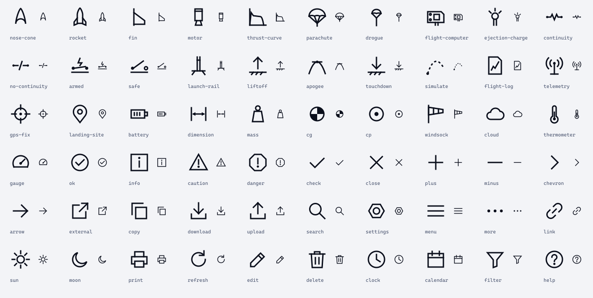

# Foundations

Colour, type, space, lines, shape, motion and icons: the parts every FusionSpace product shares, on every platform. Values here
are generated from the same source as the token files in [`tokens/`](tokens/), so they always match.

## Colour

### Brand and signal never mix

There are two kinds of colour, and they never stand in for each other.

- **Brand** says who made it: the Fusion gradient (M orange `#DA7C30` to O blue `#768DF5`), the two-tone cones, the
  spectral classes. It appears once per view (principle 6) and never means anything about state or data.
- **Signal** says what state something is in: four reserved colours, named like the spectral classes after things that glow.

| Signal | Means | Fill (every theme) | Text on fill | Ink on light | Ink on dark |
|---|---|---|---|---|---|
| **Flare** | Danger, failure, live energetics (ARMED) | `#AC001E` | `#FFFFFF` | `#AC001E` | `#FB8083` |
| **Sodium** | Caution, off-nominal, needs attention | `#F5AF20` | `#0B0F1C` | `#B34F0C` | `#F5AF20` |
| **Aurora** | Normal, safe, within limits | `#0A6355` | `#FFFFFF` | `#0A6355` | `#6AD5B6` |
| **Nebula** | Predicted, simulated, forecast, target | none: data only | – | `#A22488` | `#ED89D2` |

Why these: flight-deck and spacecraft standards reserve red for warnings and amber or yellow for cautions, keep the number of
coded colours to about six, and require a second cue besides colour (14 CFR 25.1322; FAA AC 25-11B; NASA-STD-3001 Vol 2,
appendix F; MIL-STD-1472H). Green marks a normal or safe condition. Magenta is the avionics colour for a computed target, which
is what a prediction is. The gradient's orange end and Ember sit in the alert range, so they stay out of status entirely.

Each signal was chosen in OKLCH for contrast against Paper, white, Void and Abyss, and for distance from its neighbours under
simulated protan, deutan and tritan vision (Machado et al. 2009). The closest pair stays 5.1 apart (OKLab × 100;
the build stops below 4.0). Danger and caution fills also differ in polarity, light text on deep red against dark text
on amber, so they stay apart in greyscale too.

**Fills are the same on every background**, like a safety sign: an ARMED chip looks identical on Paper, on Void and in print.
Inks (text, icons and lines in a signal colour) change with the theme so they keep their contrast.

> **Proposed, 4 October 2026.** Flare, Sodium, Aurora, Nebula and Steel are new. Ion and Ember keep the jobs they have in the
> brand guide (Ion for links and UI on light, Ember for warnings on light, here the caution ink).

### Semantic roles

Code uses roles, never hex values. Each role has a value in three themes.

| Role | Light | Dark | Field | For |
|---|---|---|---|---|
| `canvas` | `#F3F4F7` | `#0B0F1C` | `#FFFFFF` | Page and screen background |
| `surface` | `#FFFFFF` | `#141A2B` | `#FFFFFF` | Raised panels, inputs, tables, dialogs (separated by rules, never shadows) |
| `rule` | `#D6DAE4` | `#2A3248` | `#98A1B8` | Hairlines between rows, sections and cells (decoration: no contrast minimum) |
| `rule-strong` | `#566079` | `#6D7790` | `#0B0F1C` | Control borders and chart axes (3:1 against canvas and surface) |
| `ink` | `#0B0F1C` | `#F3F4F7` | `#0B0F1C` | Text, primary lines, measured data |
| `ink-muted` | `#566079` | `#98A1B8` | `#2A3248` | Secondary text: labels, units, captions, sources |
| `ink-faint` | `#98A1B8` | `#566079` | `#566079` | Disabled text, placeholders, hatching (not for anything that must be read) |
| `action` | `#3350D6` | `#768DF5` | `#3350D6` | Links, selection, focus, the one interactive accent |
| `on-action` | `#FFFFFF` | `#0B0F1C` | `#FFFFFF` | Text on an action fill |
| `focus` | `#3350D6` | `#768DF5` | `#3350D6` | Focus ring (2 px outline, 2 px offset) |
| `danger` | `#AC001E` | `#FB8083` | `#AC001E` | Danger ink: text, icons and lines |
| `caution` | `#B34F0C` | `#F5AF20` | `#B34F0C` | Caution ink: text, icons and lines |
| `ok` | `#0A6355` | `#6AD5B6` | `#0A6355` | Normal ink: text, icons and lines |
| `predicted` | `#A22488` | `#ED89D2` | `#A22488` | Predicted, simulated or forecast data (always dashed or hatched too) |

Signal fills for chips, note headers and status bars: `danger-fill` #AC001E with `on-danger-fill` #FFFFFF; `caution-fill` #F5AF20 with `on-caution-fill` #0B0F1C; `ok-fill` #0A6355 with `on-ok-fill` #FFFFFF; `info-fill` #3350D6 with `on-info-fill` #FFFFFF.

### Themes

- **Light** is the default for anything used outdoors. Dark text on a light background reads better in bright surroundings
  (positive polarity; NN/g's summary of the research), and it prints.
- **Dark** follows the system setting. It suits the bench, the evening and emissive screens on hardware.
- **Field** is for the pad: a white canvas, darker secondary text, rules strong enough to see in sun. Body text is at least
  12.7 : 1, beyond NASA-STD-3001's 6 : 1 for characters. Offer it as a switch on any tool used at a launch,
  and make it the default on countdown, arming and recovery screens. On iOS it is the Increase Contrast variant of each
  colour.

### Contrast

WCAG 2.2 AA is the floor everywhere: 4.5 : 1 for text, 3 : 1 for large text, icons, control borders, chart lines and focus
indicators. The build measures every pair below and stops if one fails.

| Theme | Foreground | On | Ratio | Minimum |
|---|---|---|---|---|
| light | `ink` #0B0F1C | canvas #F3F4F7 | 17.37 | 7 |
| dark | `ink` #F3F4F7 | canvas #0B0F1C | 17.37 | 7 |
| field | `ink` #0B0F1C | canvas #FFFFFF | 19.10 | 10 |
| light | `ink-muted` #566079 | canvas #F3F4F7 | 5.71 | 4.5 |
| dark | `ink-muted` #98A1B8 | canvas #0B0F1C | 7.39 | 4.5 |
| field | `ink-muted` #2A3248 | canvas #FFFFFF | 12.74 | 7 |
| light | `action` #3350D6 | canvas #F3F4F7 | 5.86 | 4.5 |
| dark | `action` #768DF5 | canvas #0B0F1C | 6.28 | 4.5 |
| field | `action` #3350D6 | canvas #FFFFFF | 6.44 | 4.5 |
| light | `focus` #3350D6 | canvas #F3F4F7 | 5.86 | 3 |
| dark | `focus` #768DF5 | canvas #0B0F1C | 6.28 | 3 |
| field | `focus` #3350D6 | canvas #FFFFFF | 6.44 | 3 |
| light | `rule-strong` #566079 | canvas #F3F4F7 | 5.71 | 3 |
| dark | `rule-strong` #6D7790 | canvas #0B0F1C | 4.27 | 3 |
| field | `rule-strong` #0B0F1C | canvas #FFFFFF | 19.10 | 3 |
| light | `danger` #AC001E | canvas #F3F4F7 | 6.89 | 4.5 |
| dark | `danger` #FB8083 | canvas #0B0F1C | 7.75 | 4.5 |
| field | `danger` #AC001E | canvas #FFFFFF | 7.57 | 6 |
| light | `caution` #B34F0C | canvas #F3F4F7 | 4.73 | 4.5 |
| dark | `caution` #F5AF20 | canvas #0B0F1C | 10.04 | 4.5 |
| field | `caution` #B34F0C | canvas #FFFFFF | 5.20 | 4.5 |
| light | `ok` #0A6355 | canvas #F3F4F7 | 6.52 | 4.5 |
| dark | `ok` #6AD5B6 | canvas #0B0F1C | 10.74 | 4.5 |
| field | `ok` #0A6355 | canvas #FFFFFF | 7.17 | 4.5 |
| light | `predicted` #A22488 | canvas #F3F4F7 | 6.07 | 4.5 |
| dark | `predicted` #ED89D2 | canvas #0B0F1C | 8.29 | 4.5 |
| field | `predicted` #A22488 | canvas #FFFFFF | 6.68 | 6 |
| all | text on `danger-fill` | #AC001E | 7.57 | 4.5 |
| all | text on `caution-fill` | #F5AF20 | 10.04 | 4.5 |
| all | text on `ok-fill` | #0A6355 | 7.17 | 4.5 |
| all | text on `info-fill` | #3350D6 | 6.44 | 4.5 |

Ink clears 17 : 1 on the canvas in every theme, so headline readouts
are always ink. Muted text clears 5.7 : 1 on light,
7.4 : 1 on dark and 12.7 : 1 in the
field theme. APCA and WCAG 3 are not ready to build on (W3C says WCAG 3 is years away); use them as a second opinion only.

### Data colours

Measured data is ink. Predicted data is Nebula and dashed. When several measured series share a chart, they take these inks in
order, and never a signal colour:

| Series | Light and field | Dark |
|---|---|---|
| 1 | `#0B0F1C` | `#F3F4F7` |
| 2 | `#3350D6` | `#768DF5` |
| 3 | `#B34F0C` | `#DA7C30` |
| 4 | `#566079` | `#98A1B8` |

The O and M ends of the brand appear here as inks (Ion and Ember on light are the gradient ends deepened to pass 3 : 1), so
two-series charts read as FusionSpace without the gradient. For quantities (heat maps, dispersion density), use ramps built from
the spectral classes:

- **Cool sequential** F → A → B → O and **warm sequential** G → K → M, each running from light to dark.
- **Diverging** O → B → F → K → M for signed values (residuals, error against prediction), with F as zero.
- Never the gradient as a scale: its four stops have the same lightness, so it carries no order and turns to one grey in
  print.

## Type

Two families, both open source (SIL OFL), in `type/fonts`:

- **Cascadia Mono** for what you read as data or as a drawing: titles, labels, numbers, units, codes, readouts, title blocks.
  Every digit is the same width, so columns line up and values don't jitter as they change.
- **Archivo** for what you read as prose: paragraphs, help, descriptions. Turn on tabular figures
  (`font-variant-numeric: tabular-nums`) wherever Archivo shows a number.
- On iOS and Android, body text and controls use the system font so they scale with Dynamic Type and font scaling; Cascadia
  Mono and Archivo carry titles, labels and readouts.

| Token | Size / line | Family | Weight | Case | Use |
|---|---|---|---|---|---|
| `label` | 12 / 16 px | Cascadia Mono | 400 | capitals | Field labels, column heads, title-block cells, sheet numbers |
| `small` | 14 / 20 px | Archivo | 400 | as written | Captions, helper text, sources, footnotes |
| `body` | 16 / 24 px | Archivo | 400 | as written | Running text and controls |
| `lead` | 20 / 28 px | Archivo | 400 | as written | The one-sentence summary under a page title |
| `heading` | 14 / 20 px | Cascadia Mono | 600 | capitals | Section heads inside a sheet |
| `title` | 28 / 32 px | Cascadia Mono | 600 | as written | Page and screen titles |
| `display` | 40 / 44 px | Cascadia Mono | 600 | as written | The one big title on a landing page |
| `hero` | 56 / 60 px | Cascadia Mono | 600 | as written | Print covers and splash only |
| `readout` | 28 / 32 px | Cascadia Mono | 400 | as written | A single headline value (apogee, charge mass) |
| `readout-l` | 40 / 44 px | Cascadia Mono | 400 | as written | The value a screen exists to show |
| `code` | 14 / 20 px | Cascadia Mono | 400 | as written | Code, commands, file names, part numbers |

- Headings and readouts step by √2, the ISO 3098 lettering series (2.5, 3.5, 5, 7, 10, 14 mm) at 4 px per mm. Body and small
  text sit between, at 16 and 14.
- **Capitals only where a drawing uses them:** labels, column heads, title-block cells, sheet numbers, signal words (CAUTION,
  WARNING) and single-word states (ARMED, SAFE). Never for sentences, and never as a floating label above a heading.
- No weight lighter than 400 anywhere; no text smaller than 12 px on screen, or 2.5 mm (about 7 pt) in print.
- Line length at most 68 characters.

## Space and layout

- **4 px base, 8 px rhythm.** Spacing tokens: 2, 4, 8, 12, 16, 24, 32, 48, 64, 96 px.
- **The sheet.** A page is a stack of sheets. Each sheet has a 2 px ink rule along its top, a rail with `SHEET n / N` and its
  name, and its content. On narrow screens the rail sits above the content.
- **Results next to inputs.** Tools put inputs on the left and the result on the right, with the result kept in view as the
  inputs scroll; on a phone the result comes straight after the inputs.
- **Width.** Content up to 1120 px; prose up to 68 characters; gutters 16 px on phones, 32 px from 720 px.
- **Alignment.** Flush left, ragged right. Numbers align right in columns. Nothing is centred except a value inside its own
  cell, a balloon number, or an icon.

## Lines and shape

| Line | Width | Pattern | Means |
|---|---|---|---|
| Thick | 2 px | solid | Measured data, outlines, the sheet edge, the title block's border |
| Thin | 1 px | solid | Axes, control borders, table rules |
| Dashed | 1–2 px | `8 4` | Predicted, simulated, forecast; hidden or planned |
| Chain | 1 px | `24 3 1 3` | References: ground level, the rail, limits, centre lines |
| Dotted | 1 px | `1 3` | Events (with a numbered balloon) |
| Hatch | 1 px at 45°, 6 px pitch | | Unavailable, out of range, stale, uncertain areas |

- Widths keep the ISO 128 ratio of 1 : 2 (and 4 for the rare heavy line, such as a hazard edge).
- **Corners are square.** No border radius on brand-owned elements.
- **The chamfer.** One 45° cut, top right, marks a designation tag (`FS · SW · TOOL 002`) and the corner of a sheet. It points
  the way the mark points. Chamfers are 4 or 8 px. On hardware, edges are chamfered at 45°
  rather than filleted (see [`hardware.md`](hardware.md)).
- **No shadows, no blur.** Layers are separated by rules and a step in surface colour. A dialog has a 2 px ink border over a
  dimmed canvas.
- **Hatching never goes behind text.** Put it in a block beside the text, or around it.

## Motion

Motion shows a change of state and nothing else. It is mechanical: quick, damped, no overshoot, no bounce.

- Durations: quick 100 ms, base 160 ms, slow 240 ms. Easing: `cubic-bezier(0.2, 0, 0, 1)` in, `cubic-bezier(0.3, 0, 1, 1)` out.
- No animated gradients, no parallax, no animated backgrounds, no shimmer.
- Live values: anything people read precisely updates at most once a second; anything read for its trend may update 3 to 4
  times a second (MIL-STD-1472H). Pair a fast-changing number with a trace or a trend arrow instead of making it flicker.
- Flashing only for "act now", at two rates (NASA-STD-3001): warning 3 Hz at
  50 % on, low priority 0.8 Hz at 70 % on.
  All flashing is synchronised and can be stopped; flash a glyph or bar beside text, never the text itself.
- With reduced motion set, everything snaps.

## Icons

60 icons in [`icons/`](icons/), drawn for FusionSpace on a 24 px grid: 1.5 px strokes, square ends, mitred
corners, lines at 0°, 45° and 90°, arcs only where the object is round. The domain icons are drawn from the real things: the
nose cone is the Von Kármán profile with the notch the mark uses; continuity is the resistor symbol of an e-match bridge wire;
armed and safe are a closed and an open switch; CG and CP use the symbols from rocketry software.

- Status icons differ in shape, not only colour: circle for normal, square for information, triangle for caution, octagon for
  danger.
- Icons are `currentColor`; size them at 16, 20 or 24 px (or 1×, 1.25×, 1.5× the text).
- An icon always has a text label next to it or an accessible name, except the universal few (close, menu, search).
- On iOS and Android, use SF Symbols and Material Symbols for system actions; use these for the rocketry domain.

## Tokens

[`tokens/`](tokens/) holds every value above in the format each platform reads. All are generated by
`tools/build/kit_product.py`; change the values there.

| File | For |
|---|---|
| `primitives.tokens.json`, `light.tokens.json`, `dark.tokens.json`, `field.tokens.json` | Design Tokens (DTCG 2025.10) source: Style Dictionary and other tools |
| `fusionspace-ui.css` | Web: custom properties, light/dark by system or `data-theme`, field by `data-theme="field"` |
| `FusionSpaceColors.swift` | SwiftUI: dynamic colours (light, dark, Increase Contrast = field), brand fonts with Dynamic Type |
| `FusionSpaceColors.kt` | Jetpack Compose: `FsColors` for light/dark/field and Material 3 colour schemes |
| `fusionspace_ui.h` | Firmware: the dark roles as RGB888 (LVGL) and RGB565 (TFT drivers), flash timings |
