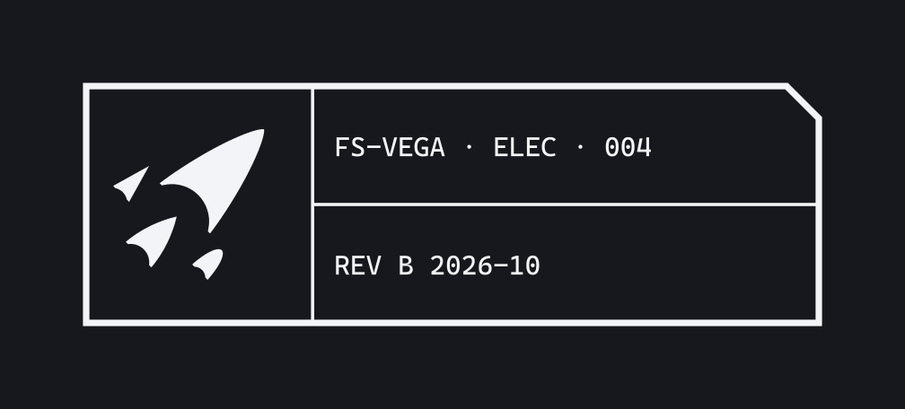

# Boards, enclosures and labels

PCBs, enclosures, cables, connectors and labels. Hardware is where the drawing language stops being a metaphor: these are
drawings, parts and title blocks for real.

Files: the mark as KiCad footprints in `kit/pcb/`, the board title block in [`hardware/`](hardware/), cut files and cable tags
in `kit/production/` and `kit/3d-print/`, FreeCAD drawing templates in `templates/freecad/`.

## Designations

Every board, enclosure and harness has a designation and a revision, on the part itself:

- Board: `FS-VEGA · ELEC · 004 rev B` (project, discipline tag, number, revision). Released revisions are letters, skipping I,
  O, Q, S, X and Z; prototypes use `rev –` or `rev P1`.
- Firmware states the board revisions it supports, and reports both on boot: `FS-VEGA · EMB · 002 1.4.0 on ELEC · 004 rev B`.
- Every revision has a changelog entry in the project's drawing (ZONE, REV, DESCRIPTION, DATE, APPROVED).

## PCBs

### Silkscreen

- **The board title block** goes on the back: the mark, designation, revision, date (`2026-10`), and optionally a QR code that
  links to the board's sheet (Framework does this on its parts). Use the footprint in
  [`hardware/FusionSpace.pretty`](hardware/FusionSpace.pretty/); it pulls the title and revision from the board's text
  variables.
- **Text** at least 1.2 mm tall with a 0.15 mm stroke (8 : 1, the ISO 3098
  ratio). Fabs allow less (JLCPCB 1.0 mm text and 0.15 mm lines, PCBWay 0.8 mm, OSH Park 5 mil lines), but labels people read
  at arm's length need more: MIL-STD-1472H puts the minimum for reading at under 0.5 m at about 2.3 mm.
- **Labels say what, not just which:** `CH1 DROGUE`, `CH2 MAIN`, `ARM SW`, `BATT 2S`, `GPS`, `PWR`, `TP3 3V3`. Reference
  designators can be hidden on dense boards if the assembly drawing has them.
- **Pin 1, polarity and direction** marked on every connector, diode, LED, battery and polarised capacitor, on the side you see
  when assembling.
- **Pyro terminals** in a silkscreen box with the channel name and a small hazard mark (45° hatch), and their screw terminals
  facing the same way on every FusionSpace board.
- Mounting holes have a keep-out ring; the mark from `kit/pcb/` (8 mm or larger for crisp tips) goes on the front only if it
  doesn't crowd a label.

### Shape and size

- **Corners chamfered at 45°**, 1 mm, not rounded: the brand's angle, and an easy edge to route and to file.
- Sized to slide into standard av-bays and couplers: inside diameters of about 25.5 mm (29 mm coupler, 1.006 in), 35.0 mm
  (38 mm, 1.380 in) and 50.7 mm (54 mm, 1.997 in). Sled-mounted boards: width at most the coupler inside diameter minus 2 mm.
- Mounting by #4 or M3 screws on nylon standoffs, on a grid the project keeps across revisions.

### Mask and finish

- Released boards: **matte black mask, white silkscreen, ENIG** (the Void look, and the most readable labels). The trade-off is
  real: black hides traces and makes inspection harder, so prototypes and boards you expect to rework use green or OSH Park
  purple. The FusionSpace mark can be exposed copper (`_FCu` footprints) for a gold mark on ENIG.

## Enclosures

- **Colour:** Void (black) or a dark grey body; one hi-vis accent where something must be found or noticed: Sodium for guards
  and hazard controls, fluorescent orange for things that get lost in grass. No other colours.
- **Material outdoors:** ASA or PETG over PLA (PLA softens in a hot car or in desert sun).
- **Edges chamfered at 45°**, not filleted: it repeats the mark's angle, and a 45° chamfer on a bottom edge prints without
  support where a fillet doesn't. Chamfer 0.8 to 2 mm depending on size.
- **Labels:** engraved, embossed or printed in Cascadia Mono capitals, at least 2.5 mm tall for controls (5 mm for anything
  read from a metre); the mark debossed 0.4 mm on one face, at least 8 mm tall.
- **Hazard edges:** a 45° Sodium and Void band around anything that arms or launches (NASA-STD-3001's black and yellow hazard
  border; ISO 3864 marking).
- A **title-block label** on the underside: designation, revision, serial, date, contact. Use
  `kit/3d-print/` or a printed label in the title-block layout.

## Cables and connectors

- **No two connectors on one device that can be swapped dangerously.** Pyro, power and sensor connectors differ in pitch,
  pin count or keying; a battery connector can't fit a pyro header.
- **Wire colours:** red positive, black negative/ground. Pyro leads are labelled by channel with a tag (`kit/3d-print/` cable
  tags) rather than relying on colour, because no rocketry colour standard for them exists.
- Every harness has a tag with its designation and both ends' names: `ELEC · 004 J3 → CH2 MAIN`.

## Drawings

- Mechanical drawings use the FreeCAD templates in `templates/freecad/` (ANSI A, ANSI B, A4), with the title block filled in.
  Default general tolerance note for printed parts: `ISO 2768-mK`; for machined parts, the drawing states its own.
- Line types and lettering as in [`foundations.md`](foundations.md#lines-and-shape); dimensions in mm without digit grouping.
- Schematics: one sheet per function, the title block filled from KiCad's text variables, nets named for what they carry
  (`PYRO1_FIRE`, `VBATT`), and a block diagram on sheet 1.
