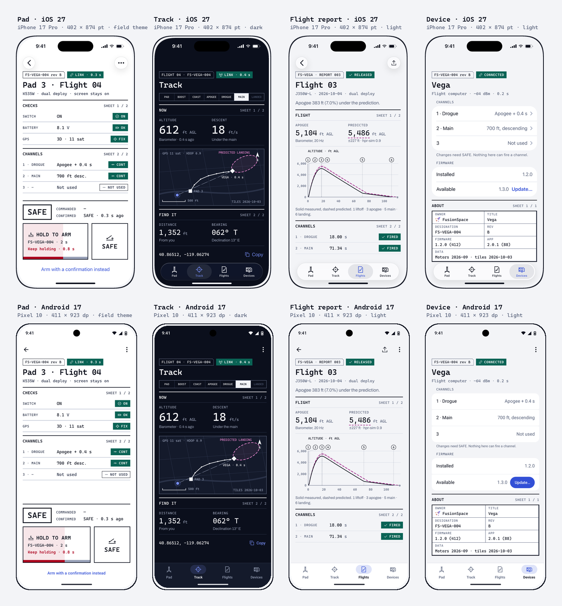

# Phones

Reference parts for FusionSpace iOS and Android apps. The rules are in `product/mobile.md`; this folder draws them and puts
the content layer into code. Generated by `tools/build/kit_mobile.py` from `source/product/mobile/`.

## Screens

Each screen exists on both platforms with the same content and each platform's own chrome: the iPhone 17 Pro (402 × 874 pt) on
iOS 27 with Liquid Glass bars and system lists, and the Pixel 10 (411 × 923 dp) on Android 17 with Material 3
bars and Roboto. Open the HTML in a browser, or look at the PNG (2x).

| Screen | Theme | What it shows |
|---|---|---|
| `screens/{ios,android}-pad` | field theme | checks, channels, state, hold to arm |
| `screens/{ios,android}-track` | dark | phase, readouts, offline map, distance and bearing |
| `screens/{ios,android}-report` | light | readouts, altitude chart, channels |
| `screens/{ios,android}-device` | light | system lists for settings, the title block as About |

`devices/` has the same screens running for real (simulator and emulator captures).

`screens/mock.css` draws the platform chrome for the mock-ups only; apps use the system's bars. The status-bar and Dynamic
Island glyphs are drawn stand-ins, not Apple's or Google's artwork.

## Glanceable surfaces

`glance/index.html`, shot as one PNG per surface:

| File | What |
|---|---|
| `glance/ios-live-activity.png` | Lock Screen Live Activity: at the pad, in flight, landed |
| `glance/ios-dynamic-island.png` | Dynamic Island compact, minimal and expanded, and the Apple Watch Smart Stack |
| `glance/ios-widgets.png` | Window's widget in light, dark, tinted and clear, and the Lock Screen accessories |
| `glance/android-live-update.png` | Live Update: the status-bar chip, ProgressStyle (Android 16) and MetricStyle (Android 17) |
| `glance/android-widget.png` | The Glance widget, 4 × 2 cells, light and dark |

## Code (Apache-2.0)

Copy these into an app with `product/tokens/FusionSpaceColors.swift` or `FusionSpaceColors.kt`.

| File | What |
|---|---|
| `swiftui/FSComponents.swift` | SwiftUI parts: FSStatus, FSReadout, FSSheetHeader, FSTitleBlock, FSStateBox, FSCommandedConfirmed, FSHoldToConfirm, FSFreshness, fsKeepsScreenOn() |
| `swiftui/FSWindWidget.swift` | WidgetKit: Window's surface-wind widget, in full color, tinted, clear and vibrant |
| `swiftui/FSFlightActivity.swift` | ActivityKit: a flight's Live Activity, Lock Screen and Dynamic Island |
| `compose/FsComponents.kt` | Compose parts: FusionSpaceTheme, FsStatus, FsReadout, FsSheetHeader, FsTitleBlock, FsStateBox, FsCommandedConfirmed, FsHoldToConfirm, FsFreshness |
| `compose/FsLiveUpdate.kt` | A flight's Live Update: ProgressStyle on Android 16, MetricStyle with semantic colors on Android 17 |

**Proven on real screens** (October 6, 2026): every file here runs in the sample apps (`source/product/samples/apple`,
`source/product/samples/android`) on the iOS 27 simulator (iPhone 17 Pro) and the Android 17 emulator (Pixel 10); their
captures are in `devices/`, next to the drawn screens they prove. Running them found what compiling didn't: the hold
control filling the screen (both platforms), `fsKeepsScreenOn()` breaking widget extensions, status chips upper-casing
units, Material's default purple in Compose dialogs, the Dynamic Island cutting the SAFE box. The drawn screens are
checked by `tools/build/kit_clip.py`: nothing may be cut by the screen's real outline or sit under a bar.

`fonts/Roboto.woff2` is a Latin subset of Roboto (SIL OFL, `fonts/OFL-Roboto.txt`) so the Android mock-ups show Android's
type; apps get Roboto from the system.
