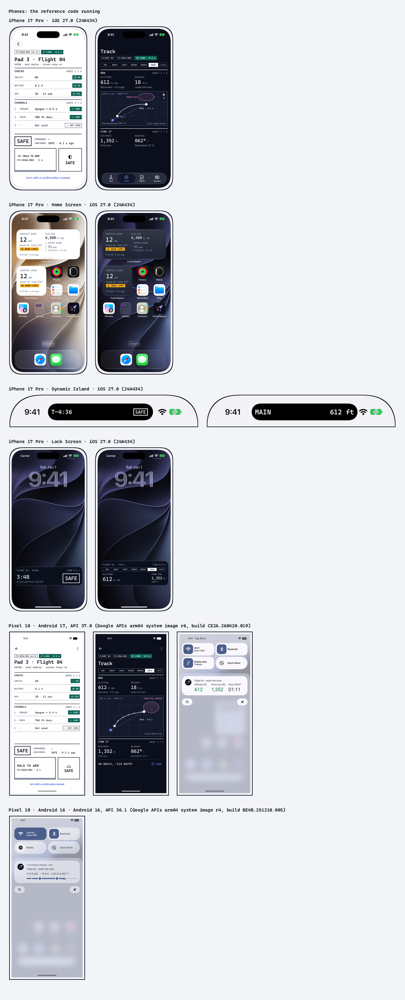

# Real screens

Screenshots of the reference code running in the sample apps on simulators and emulators, captured 2026-10-06. The drawn
mock-ups next to this folder show the intent; these show what the code actually does. Built by `tools/build/kit_devices.py`
from `source/product/devices/`, where `devices.json` records each capture's device, OS, size and what it shows.

| File | Device | Shows |
|---|---|---|
| `ios-island-flight.png` | iPhone 17 Pro, iOS 27.0 (24A434) | Live Activity in the Dynamic Island in flight (compact), -activity flight, over Settings |
| `ios-island-pad.png` | iPhone 17 Pro, iOS 27.0 (24A434) | Live Activity in the Dynamic Island at the pad (compact), -activity pad, over Settings |
| `ios-home-widgets-dark.png` | iPhone 17 Pro, iOS 27.0 (24A434) | Window's wind widget on the Home Screen, medium and small, system dark appearance; added through Device Hub (long-press, Edit, Add Widget); built with FS_CAPTURE_CLOCK=9:41 so the measured time agrees with the status bar |
| `ios-home-widgets-light.png` | iPhone 17 Pro, iOS 27.0 (24A434) | Window's wind widget on the Home Screen, medium and small, system light appearance; added through Device Hub (long-press, Edit, Add Widget); built with FS_CAPTURE_CLOCK=9:41 so the measured time agrees with the status bar |
| `ios-pad.png` | iPhone 17 Pro, iOS 27.0 (24A434) | Pad screen (field theme), sample app opened from its Home Screen icon through Device Hub (screen chosen in the app's defaults, so iOS draws no back-link); FusionSpace SF Symbols in the chips |
| `ios-track.png` | iPhone 17 Pro, iOS 27.0 (24A434) | Track screen, system dark appearance, opened from the Home Screen icon through Device Hub (no back-link); FusionSpace SF Symbols in the tab bar and chips |
| `ios-lock-flight.png` | iPhone 17 Pro, iOS 27.0 (24A434) | Live Activity on the Lock Screen in flight (phase strip, altitude, distance and bearing), -activity flight, locked and woken with the power button through Device Hub; dark |
| `ios-lock-pad.png` | iPhone 17 Pro, iOS 27.0 (24A434) | Live Activity on the Lock Screen at the pad (countdown and the device's SAFE state), -activity pad, locked and woken with the power button through Device Hub; dark. Built with FS_CAPTURE_CLOCK=9:41, so the pad time (9:45 AM) agrees with the 9:41 clock and the 3:48 countdown |
| `phone-pad.png` | Pixel 10, Android 17, API 37.0 (Google APIs arm64 system image r6, build CE2A.260420.019) | Pad, field theme |
| `phone-track.png` | Pixel 10, Android 17, API 37.0 (Google APIs arm64 system image r6, build CE2A.260420.019) | Track, dark |
| `phone-live-update.png` | Pixel 10, Android 17, API 37.0 (Google APIs arm64 system image r6, build CE2A.260420.019) | Live Update in the notification shade (MetricStyle, semantic style SAFE) |
| `phone-live-update-android16.png` | Pixel 10, Android 16, API 36.1 (Google APIs arm64 system image r4, build BE4B.251210.005) | Live Update in the notification shade on Android 16 (ProgressStyle: the phases as segments, apogee and main as points, the rocket as the tracker; promoted, with the 612 ft chip in the status bar) |

The sample apps are in `source/product/samples/` (their READMEs list what running them found and fixed).
