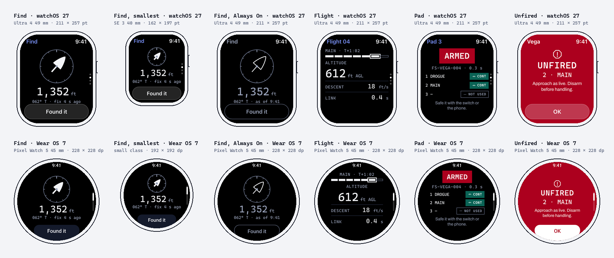
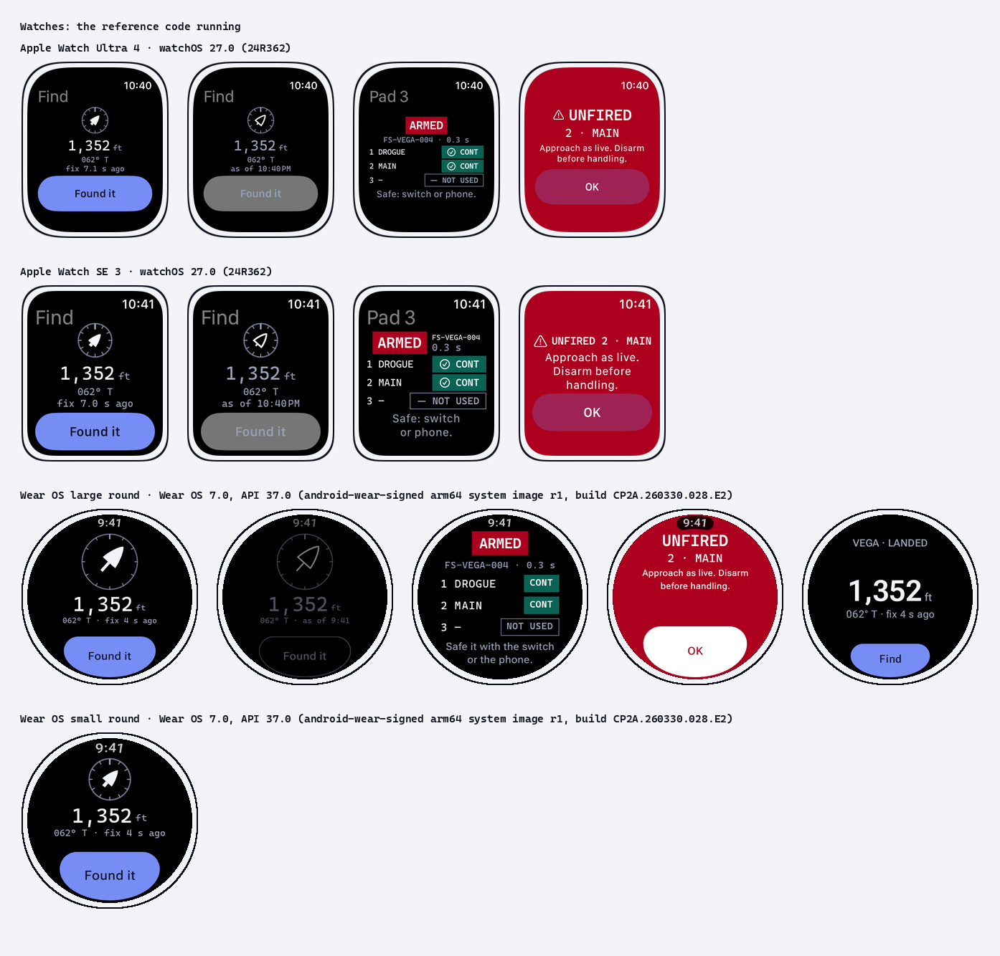

# Apple Watch and Wear OS

At a launch the hands are busy: carrying a rocket to the pad, holding a rail, walking a mile of desert to where the rocket came
down. A watch is the screen that's still there. In this system it does three things: it **finds** (the way to a landed rocket),
it lets you **glance** (a flight in progress, the device's state at the pad, the wind) and it lets you **feel** (a tap on the
wrist for the few events that matter). Everything that changes hardware stays on the device and the phone.

Principle 8 holds as on phones: **the platform owns behavior, FusionSpace owns content**
([`mobile.md`](mobile.md)). Reference parts: [`watch/`](watch/) (five screens on both platforms, complications, the Smart
Stack and tiles, and SwiftUI and Compose code).

## What a watch never does

- **It never commands hardware.** No ARM, no SAFE, no FIRE, no ground test, no configuration change, no firmware update. A watch
  screen is small enough that a cuff, a glove or a turn of the wrist can touch it, and there is no room for the device's
  designation and two separate actions ([`embedded.md`](embedded.md#arming-and-safety)). Arming is the airframe switch plus
  the phone; safing is the switch, or the phone. The watch shows the state, including commanded and confirmed.
- **It is never the only alert.** An unfired charge is reported first by the device (screen, LED, beeper) and the phone; the
  watch adds a tap and a full screen, it doesn't replace them.
- **It doesn't decide.** Like every FusionSpace product it shows the wind and the limit, never a go or no-go.

## What the platform owns

- **watchOS 27.** Navigation (`NavigationStack`, vertical `TabView` pages), the time at the top right, toolbar
  buttons in Liquid Glass (watchOS 26 and later), scrolling with the Digital Crown, SF Compact, Dynamic Type (to 140%), the
  Smart Stack, Always On. Double tap (`handGestureShortcut(.primaryAction)`) and the Ultra's Action button run the screen's
  primary action, which here is never a hardware command (on Find: "Found it").
- **Wear OS.** `AppScaffold` and `ScreenScaffold`, `TimeText` on its arc at the top, the edge-hugging `EdgeButton`, scrolling
  lists (`TransformingLazyColumn`) with the rotary input, swipe to dismiss, Material 3 Expressive shapes and motion (Wear
  Compose Material 3 1.7). Wear Compose's double pinch runs the primary action, the same rule as double tap. Tiles,
  complications, Live Updates and ongoing activities are the system's surfaces; the app fills them. The scheme is the static
  FusionSpace one, not dynamic color, for the same reason as on phones: the colors mean something.
- **Targets.** 44 × 44 pt on watchOS, 48 × 48 dp on Wear OS. Gloves at the field make these minimums, not goals: the one
  button on a watch screen is full width (watchOS) or the edge button (Wear OS).
- **Accessibility.** VoiceOver and TalkBack labels (every readout is one element with its unit spoken), larger text, Reduce
  Motion, and the system haptics settings.

## What FusionSpace owns

- **The dark roles, always.** A watch is an emissive screen on a black face, and OLED black draws no power. Ink is Paper on
  black; muted is Haze. The field theme isn't used: a watch's own brightness does that job.
- **Type.** Cascadia Mono for readouts, labels, codes and the state box; the system font for titles, buttons and prose. At
  least 12 pt/sp in apps (Apple's minimum on watchOS; default body text is 16-17 pt); complications follow the system's sizes.
- **One number per screen.** A watch screen exists for one readout (distance, altitude) with its unit and its age; at most two
  supporting values under it, each with a unit. Ranges and charts stay on the phone.
- **Signals.** The same words, shapes and fills as everywhere: `SAFE` in an outline box, `ARMED` inverted in Flare, `CONT` in
  Aurora, `NOT USED` outlined and gray, `UNFIRED` as a whole screen in Flare.
- **The arrow is a nose cone.** The way to the rocket is drawn as the brand's own Von Kármán profile pointing along the bearing,
  on a ring with the wearer's heading at the top.

## Screens

The reference screens in [`watch/screens/`](watch/screens/), each on an
Apple Watch Ultra 4 49 mm (211 × 257 pt) and a
Pixel Watch 5 45 mm (drawn at 228 dp, the large round class). Find is also drawn at the smallest sizes,
an Apple Watch SE 3 40 mm (162 × 197 pt) and Wear OS's small class (192 dp): design for the smallest
first. Current Apple Watch screens, from Apple's pixel sizes at @2x: Series 11 and 12 at 187 × 223 pt (42 mm) and 208 × 248 pt
(46 mm), Ultra 3 and 4 at 211 × 257 pt, SE 3 at 162 × 197 pt (40 mm) and 184 × 224 pt (44 mm). Wear OS publishes size classes,
not devices: small 192-224 dp, large 225 dp and up.

- **Find.** The arrow relative to where the wrist points, the distance (`1,352 ft`), the bearing in degrees true and the age of
  the rocket's fix (`062° T · fix 4 s ago`). Without a compass reading the arrow points from north and the line says
  `from north`. "Found it" ends tracking. The watch's own GPS gives your position; the rocket's comes from the phone or the
  ground station.
- **Find, Always On.** The same screen dimmed: the arrow outlined, values muted, and the age replaced by when it was true
  (`as of 9:41`), because a dimmed screen redraws about once a minute and a counting age would be wrong between redraws.
- **Flight.** The phase as a strip of seven cells (done filled, now ringed, next outlined), altitude, descent rate, link age.
- **Pad.** The device's designation and link age, its state in the box, the channels in order. Read only; the footnote says
  where safing is done.
- **Unfired.** After landing, a configured charge that didn't fire takes the whole screen in Flare, first: `UNFIRED`, the
  channel, "Approach as live. Disarm before handling.", and OK, which stops the taps (not the device).

## Always On and ambient

- watchOS: read `isLuminanceReduced`; the screen redraws about once a minute, and the app stays frontmost for about 2 minutes
  by default (up to an hour, the wearer's setting). Wear OS: `LocalAmbientModeManager` (`AmbientMode.Ambient`) and
  `AmbientTickEffect`, about once a minute.
- Keep the layout. Fills become outlines, ink becomes muted, motion stops, and the control stays, shown as unavailable
  (outlined and muted), instead of disappearing. Nothing counts seconds.
- A position stays true until the next fix, so Find keeps it and says when it was true (`as of 9:41`). A value that keeps
  changing (altitude in flight) becomes `--` until the screen wakes, as Google asks. Past its stale limit a value says
  `STALE` in words.
- `ARMED` and `UNFIRED` stay as words in their boxes even dimmed. Wear OS: at least 85% of the screen black, content 10 px or
  more from the edge for burn-in, and no fills where `isBurnInProtectionRequired`.

## Complications, Smart Stack and tiles

Drawn in [`watch/faces/`](watch/faces/).

- **One value with its unit and its age** on every family; no logo. Watch faces render complications in full color or
  accented (no vibrant mode on the watch): accented draws the content white and only the accent group in the face's color, so
  the value is the accent group (`widgetAccentable()`) and the caution is a word in an outline, never only a color. Lines at
  least 2 pt.
- **The arrow on a complication points from north**, since a complication can't follow the wrist; it says `062° T`.
- **watchOS** (45-49 mm sizes): circular 50 pt, corner 38 pt, rectangular 193 × 82 pt, Smart Stack
  191 × 81.5 pt on 49 mm. Find on every accessory family. The phone's Live Activity arrives in the Smart Stack on its own
  during a flight ([`mobile.md`](mobile.md#glanceable-surfaces)); give it a `.small` layout. The Find widget raises its own
  relevance (RelevanceKit) only while a rocket is out and unfound.
- **Wear OS.** A Find tile (title slot, main slot, an edge button that opens the app), refreshed at most once a minute;
  complications as `SHORT_TEXT` (distance), `LONG_TEXT` (name, distance, bearing) and `RANGED_VALUE` (altitude on the way
  down), which Wear OS updates at most every 5 minutes on average, which is why they carry the fix's age. A tile is a glance:
  anything that moves belongs in the app. Wear OS 7 adds Wear Widgets (Glance, still alpha); tiles stay supported, and the
  same one-value rule carries over.

## The wrist language

One tap pattern per meaning, mirroring the device's beep language ([`embedded.md`](embedded.md#beeps)). Nothing routine taps
the wrist: no tap for an altitude update or for a phase the flier can see coming. Taps are a second cue; the screen says the
same thing in words.

| Event | Device | watchOS (`WKHapticType`) | Wear OS (composition primitives) |
|---|---|---|---|
| Liftoff detected | — | `start` | `QUICK_RISE` |
| Main out | — | `click` | `CLICK` |
| Landed, every charge fired | apogee in beeps | `success` | `CLICK`, `CLICK` |
| **A charge didn't fire** | rapid triple ×3 | `failure` ×3, 0.6 s apart, repeating until OK | `THUD` ×3 |
| Link lost (fix older than 60 s) | — | `retry` | `LOW_TICK` ×2 |
| Link back | — | `click` | `TICK` |
| Within 30 ft of the rocket | — | `notification` | `SLOW_RISE`, `CLICK` |

Where a Wear OS watch lacks a primitive, the code falls back to the predefined effects (`EFFECT_HEAVY_CLICK`, `EFFECT_CLICK`,
`EFFECT_DOUBLE_CLICK`, `EFFECT_TICK`).

Taps from the app play while it's on screen (watchOS plays nothing from the background outside a workout session). When the
watch is down, the unfired alert arrives as a time-sensitive notification, from the phone or from the device over Bluetooth;
watchOS allows 5 Bluetooth alerts in 24 hours, enough for a rare alarm and a reason never to send routine ones.

## Staying alive and connected

- **Find runs for as long as the walk** (often 10-30 minutes). watchOS: a background location session
  (`allowsBackgroundLocationUpdates`), which Apple lists for this, not a workout session. Wear OS: a foreground service with
  location, shown on the face as a **Live Update** on Wear OS 7 (Google's recommendation; the phone's Live Update may also be
  bridged to the watch, but not on every watch, and `MetricStyle` isn't shown there, so build it with `ProgressStyle`) or an
  ongoing activity on Wear OS 6 and earlier. Release it on "Found it".
- **Compass and GPS.** Every current Apple Watch and the Pixel Watch 5 have both. Without a heading, Find points from north and
  says so.
- **Data path.** The rocket's position reaches the watch from the phone, or straight from the ground station or flight
  computer over Bluetooth (on watchOS 26 and later, an accessory the iPhone app set up with AccessorySetupKit can be used
  from the watch app). Either way the screen shows the age of the fix.
- **Offline.** Nothing needs a network at the field: the watch's GPS and compass, and a link to the phone or the ground station.

## Real screens

The reference code runs in two sample apps, `source/product/samples/apple` (Xcode, generated with XcodeGen) and
`source/product/samples/android` (Gradle), which compile the files in `product/` in place. Their simulator and emulator
captures are in [`watch/devices/`](watch/devices/):

They also carry the platforms' accessibility checks as tests (Apple's audit as UI tests, on the SE 40 mm and the Ultra; on
Wear OS, the Accessibility Test Framework at 100% and 124% text), and the screens are checked by eye on the smallest watches
at xxxLarge and Accessibility 3 (the watch app's `-typesize`), and on Wear OS at 124%, its largest: nothing may be cut,
truncated or split, and at the largest sizes the screens scroll instead. Run them after changing anything in `product/watch/` or `product/tokens/`: compiling is not enough. On October 6, 2026
running them found layout bugs that every compile check had passed (a control taking the whole screen, text under a
button, a border cut by a rounded end, units in capitals), all fixed in the files here.

## Checklist

- [ ] Nothing on the watch commands hardware; safing is pointed to, not offered.
- [ ] Dark roles only; at least 11 pt/sp; one readout per screen, with its unit and its age.
- [ ] Every state is a word and a shape; ARMED and UNFIRED survive Always On as words.
- [ ] Always On / ambient: outlines, muted, no counting seconds, ages as times.
- [ ] Complications and tiles: one value, unit, age; readable tinted; no logo; arrows from north.
- [ ] Taps only for the events in the table; UNFIRED repeats until acknowledged.
- [ ] Find survives the screen turning off and releases its session at the end.
- [ ] Runs in the sample app on the smallest watch (SE 40 mm, Wear OS small round) with nothing cut by the edge or the bezel.
