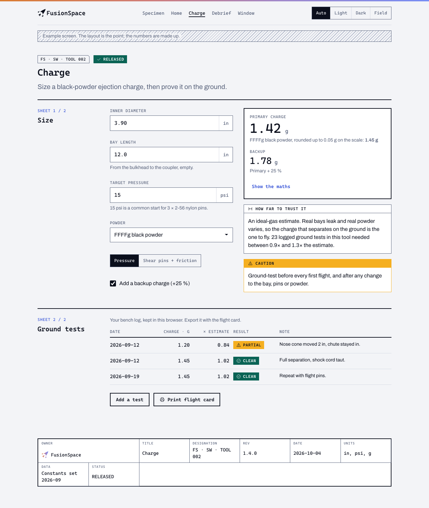
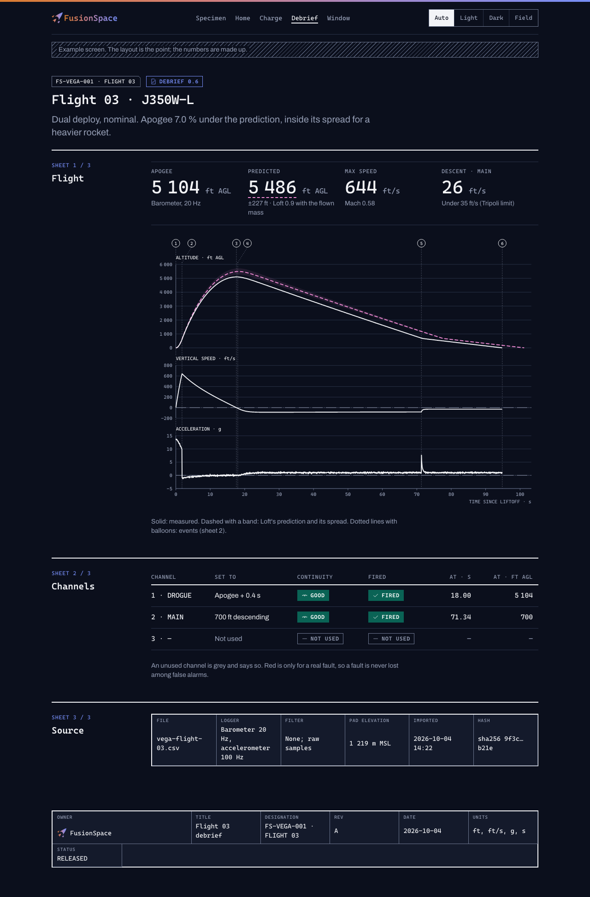
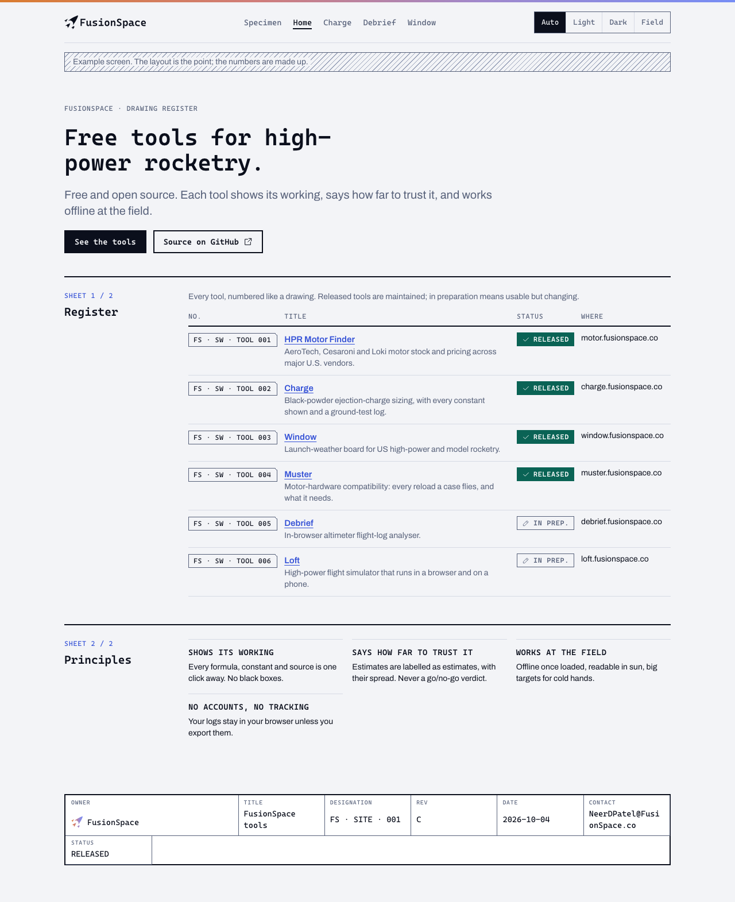
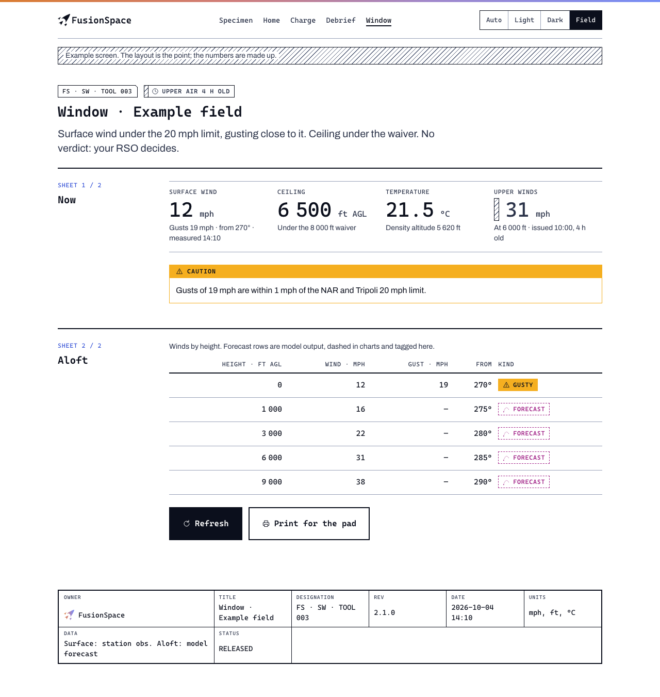

# Web

Websites, in-browser tools, progressive web apps and documentation sites. The reference implementation is
[`web/fusionspace.css`](web/fusionspace.css), with a specimen ([`web/index.html`](web/index.html)) and four example screens
in [`web/examples/`](web/examples/). Open them in a browser and switch between Light, Dark and Field.

| | |
|---|---|
|  |  |
|  |  |

## Using it in a project

1. Copy `product/web/fusionspace.css`, `fonts.css` and `fonts/` into the project (or `tailwind-theme.css` too, for Tailwind).
2. Load `fonts.css`, then `fusionspace.css`. Preload at most the two fonts used above the fold:
   `<link rel="preload" href="fonts/CascadiaMono-SemiBold.woff2" as="font" type="font/woff2" crossorigin>`.
3. Set `<meta name="color-scheme" content="light dark">` and the two `theme-color` metas (Paper and Void) from
   `kit/web/head.html`.
4. Build pages from the parts below. Use the `--fs-*` roles for anything custom; never a hex value, never a default palette.
5. Copy the icons you need from `product/icons/` as inline SVG (they use `currentColor`).

With **Tailwind**, import `tailwind-theme.css` instead of Tailwind's default theme. It maps the roles to utilities
(`bg-canvas`, `text-ink-muted`, `border-rule-strong`, `font-mono`) and removes the default palette, radii and shadows, so the
template look (indigo buttons, `rounded-xl`, `shadow-lg`) can't creep in.

## Page anatomy

```
[ gradient strip, 4 px ]
[ header: lockup · nav (Cascadia Mono 14) · theme switch ]
[ intro: designation tag · status chip · title · one-sentence lead ]
[ SHEET 1 / n · name | content ]      2 px ink rule on top of each sheet
[ SHEET 2 / n · name | content ]
[ title block: owner · title · designation · rev · date · units · data · status ]
```

- **Header.** The horizontal lockup at 24 px tall: one-colour Void on light and field, gradient on dark (the brand's rule for
  lockups under 32 px on light). Nav links in Cascadia Mono; the current page underlined 2 px. No hamburger above 720 px.
- **Intro.** The designation tag (chamfered), a status chip, the title (Cascadia Mono 28) and one sentence in `lead`. No hero
  image, no background art, no gradient text.
- **Sheets.** Each section is a sheet with its number and name in the rail. Two to six sheets per page.
- **Title block.** Every page ends with one. Fields from ISO 7200: owner (FusionSpace, with the mark), title, designation,
  revision or version, date of issue, units, data source and its date, status. On a tool it doubles as the about box.

## Site patterns

- **The home page is a drawing register**, not a grid of cards: a table of every tool with its designation, title, one-line
  description, status and address. See [`examples/home.html`](web/examples/home.html).
- **A tool page** (Charge, Window) puts inputs left and the result right, the result sticky as the inputs scroll; on a phone
  the result follows the inputs. The result panel has a 2 px ink border, the headline readout, a "Show the maths" disclosure,
  the "How far to trust it" note, and any caution.
- **An analysis page** (Debrief) leads with readouts, then the stacked chart, then the event and channel tables, then a Source
  sheet with the file, its hash and every setting used.
- **A board** (Window) is readouts plus a table, with every value's source and age, and a Print button.
- **Docs** are sheets of prose with a left table of contents; code blocks in Cascadia Mono on the surface colour.

## Components

All in `fusionspace.css`, shown in the specimen. The rules that matter:

- **Buttons.** Square, 40 px tall (64 px with `data-size="field"`), Cascadia Mono 14 semibold, sentence case. Primary is ink
  filled; hover turns it Ion. Secondary is a 2 px ink outline; quiet is an Ion text link. Danger is the Flare fill, and only
  for actions that fire, arm or destroy. Disabled is a dashed outline, and says why nearby.
- **Fields.** Label above (12 px capitals, muted), input 44 px tall with a 1 px Slate border, help below. Numbers go in
  `type="text" inputmode="decimal"` (GOV.UK's finding: `type="number"` loses leading zeros, accepts `e`, and changes on
  scroll), parsed leniently (`3,9`, ` 3.90 `), with the unit fixed in a box on the right. Errors: 2 px danger border and a
  message under the field.
- **Segmented control** for a choice among two to four (units, theme, separation method); **tabs** for views of the same thing.
- **Status chips**: word + icon + colour, see [`foundations.md`](foundations.md#colour). **Notes**: NOTE, CAUTION, WARNING
  panels with the signal word in a header strip; "How far to trust it" uses the same shape.
- **Hazard border** (45° Sodium and Void bands) around anything that arms or fires; SAFE sits right of or below ARM.
- **Dialogs** have a 2 px ink border over a dimmed page, a title, the consequence in one sentence, and buttons that repeat the
  action. Use one only to confirm something irreversible.
- **Toasts** for "saved", "copied", "new version": bottom left, 2 px ink border, gone after 6 s or on the next action. Never
  for errors.
- **Progress** is a 4 px bar in ink; indeterminate is a moving 45° hatch. Show progress for anything over a second; simulations
  run in a Web Worker so the page stays responsive.

## Theme

- Light by default, dark when the system asks (`prefers-color-scheme`), field on request. `<html data-theme="light|dark|field">`
  overrides the system; remember the choice in `localStorage` (wrapped in try/catch). A theme switch with Auto, Light, Dark and
  Field belongs on every tool used outdoors.
- Never use `theme-color` for anything but the browser chrome: Firefox ignores it and Safari 26 applies it only to installed
  web apps.
- `forced-colors` (Windows high contrast) is handled in the stylesheet: borders and outlines, never shadows, carry every
  boundary; icons are `currentColor`.

## Accessibility

WCAG 2.2 AA, with these as the ones that change the design:

- Contrast as in [`foundations.md`](foundations.md#contrast): measured by the build.
- Targets at least 24 × 24 px (2.5.8); 44 px for touch-first tools; 64 px for anything used at the pad.
- A visible focus ring on everything: 2 px Ion outline, 2 px offset (meets the 2.4.13 AAA appearance rule too). Sticky headers
  set `scroll-padding-top` so focus is never hidden (2.4.11).
- Works at 320 px wide without sideways scrolling, except data tables and charts in their own scrolling region (1.4.10).
- Status never by colour alone; charts with a text summary and their data as a table.
- `lang` set, landmarks (`header`, `main`, `nav`, `footer`), one `h1`, headings in order.
- Respect `prefers-reduced-motion`.

## Progressive web apps

Field tools should install and work offline. iOS 26 opens every home-screen site as a web app, so plan for it even without
an install prompt.

- **Manifest:** `name` FusionSpace tool name, `id`, `start_url`, `display: standalone`, `theme_color` and `background_color`
  `#0B0F1C` (Void), a `description`, wide and narrow `screenshots` (Chrome's richer install sheet), `shortcuts` for the main
  tasks, and the icons from `kit/web/` and `kit/web/site/public/`: separate `any` and `maskable` PNGs (192 and 512), a
  `monochrome` icon, an SVG, and the 180 px `apple-touch-icon`.
- **Offline:** precache the app shell; cache-first for versioned data (thrust curves, motor database, constants), with the
  version in the title block; network-first with a visible "as of" time for live data (stock, weather); logs and user data in
  IndexedDB, always exportable. Weather and map tiles are fetched before the trip with a "Save for offline" action.
- **Updates:** a toast saying "New version ready · Reload", never a forced reload in the middle of a task.
- **Storage:** installed web apps keep their storage (WebKit's 7-day eviction doesn't apply to them), but tell users to export
  anything they care about.
- **At the pad:** request a screen wake lock on countdown and tracking screens only, and release it when the screen is left.

## Performance

- Core Web Vitals at the 75th percentile on mobile: LCP ≤ 2.5 s, INP ≤ 200 ms, CLS ≤ 0.1.
- WOFF2 subsets only (`product/web/fonts/`, Latin plus the technical symbols), `font-display: swap`, metric-matched fallbacks.
- No frameworks needed for a calculator. When one is used, server-render the first view.
- Heavy work (simulation, log parsing, Monte Carlo) in a Web Worker or WebAssembly.

## Print

Every tool page prints usefully: a charge card, a flight card, a weather sheet for the pad.

- Print uses the light values whatever the theme, hides navigation and theme controls, keeps sheets and table rows together,
  shows link addresses, and keeps the title block (with date and version) on the page.
- A dedicated "Print flight card" layout is better than printing the screen: A6 or half-letter, the designation, the motor,
  the charges, the settings, blank boxes to tick and sign.
- Page margin boxes (`@page` headers and footers) only work in Chrome 131 and later, so put the date and version in the body.

## Documentation sites

`kit/software/docs-theme/` has MkDocs Material and Docusaurus themes, and `product/web/mdbook/` an mdBook theme (hpr-sim's docs
use mdBook). They apply the colours and fonts; keep the writing rules from [`writing.md`](writing.md). Every docs page starts
with what works and how far to trust it, as hpr-sim's does.

## fusionspace.co

The live site (checked 4 October 2026) uses the template look this system avoids: an indigo button, a glowing hero with a
starfield, rounded cards with pill tags, and a "Live" dot on every card. To bring it in line:

1. Replace the hero with the intro pattern (label, title, lead, two buttons: ink primary, outlined secondary).
2. Replace the project cards with the drawing register table ([example](web/examples/home.html)), using each tool's
   designation from `kit/projects/<tool>/project.json` and RELEASED or IN PREPARATION as status.
3. Drop the glow, the stars and the indigo; use `fusionspace.css` or `tailwind-theme.css` so the defaults are gone.
4. Use the one-colour lockup in the header on light (the brand's under-32 px rule) and the gradient lockup on dark.
5. Close every page with a title block, and give each tool page the result-beside-inputs layout.
6. Keep the copy's substance, which is already right ("careful about the data", "no go/no-go verdict"), and edit it to
   [`writing.md`](writing.md): no em dashes, no "genuinely".
